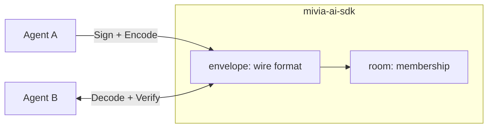
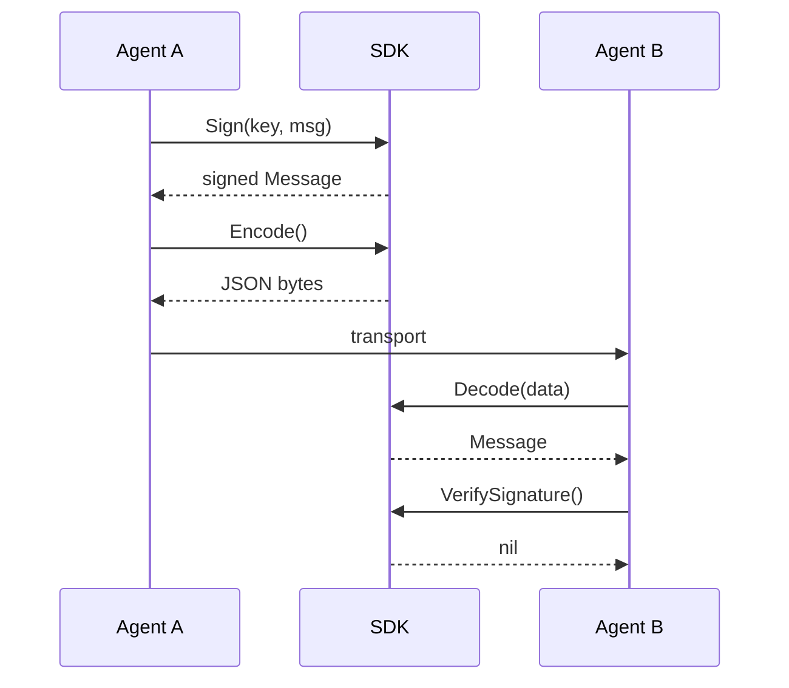
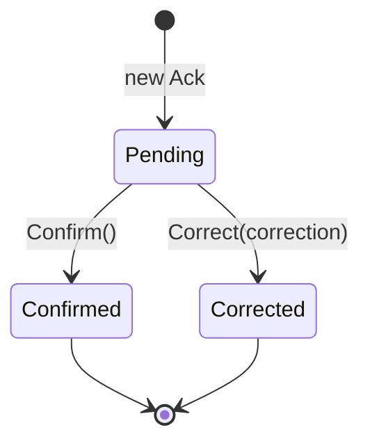

# Docs maintenance

Keep the docs in this repo tidy, accurate, and current. Small change, big
rule: a doc that disagrees with the code is a bug as serious as the code
disagreeing with itself. Your job is to stop that drift.

## Read first

- `docs/README.md` — the index. Every new or edited doc must stay in it.
- `docs/architecture.md` — the module map. Update it when the packages or
  the message flow change.
- `AGENTS.md` — the writing standard and the gates. It is the contract.

## What lives where

- `docs/protocol-design.md` — wire-protocol rationale. Why the envelope is
  shaped this way. Edit only when message semantics change; update it in
  the same change as the code.
- `docs/architecture.md` — module map, message flow, gate system.
- `docs/packages/*.md` — per-package references (envelope, room).
- `docs/examples/*.md` — walkthroughs with complete fenced Go programs.
- `docs/plans/*.md` — change contracts, one per package or concern.
- `docs/research-a2a.md` — research record for a future package.

## The writing standard

Concise is the whole point. The user's words: no fluff, concise language.

- One idea per sentence. Sentences stay at or below 25 words.
- Nothing that is not true. Every claim must match the code. Check before
  you write it.
- No filler words: simply, just, seamless, robust, powerful, modern.
- Same thing, same word. No synonym drift.
- Avoid repetition. Say it once. Delete the rest.
- Prefer the present tense and the active voice.
- `check_prose.py` enforces sentence length over every `docs/**/*.md`.
  Code fences, headings, and list lines are exempt from the length check,
  so put the verbose material there.

## Diagrams

Use Mermaid where a diagram earns its place. GitHub renders Mermaid in
fenced blocks with the `mermaid` language tag. This repo uses the hybrid
model: a context-plus-sequence approach for architecture and behavior.

A diagram earns its place when it shows a relationship a reader must
otherwise hold in memory. Draw only these three kinds, and only where
they add meaning:

1. **Context and dependency** — the package map and dependency direction.
   Use a `flowchart` in `docs/architecture.md`. Show packages and the
   actors that use them, and the message flow between them. Do not draw
   code level: the IDE shows code. Do not list every exported symbol in
   a diagram; a table does that better.
2. **Sequence** — how a message moves through the SDK over time. Use
   `sequenceDiagram` in the examples and in the architecture message-flow
   section. Sign, encode, transport, decode, verify.
3. **State** — an object lifecycle. Use `stateDiagram-v2` in the
   semantics doc for message and Ack states. The Ack states are pending,
   confirmed, and corrected.

The canonical shapes, tuned for this repo:

Rules:

- A diagram is code. Keep it under version control and in sync, exactly
  like the prose. Review it when the code it describes changes.
- Every diagram must match the code. A connection the code does not make
  is false documentation.
- A diagram must render. Check the block with a renderer before you call
  it done. A broken block shows as an error on GitHub.
- Use a diagram only when it is clearer than a sentence or a table. If
  the idea needs no diagram, do not draw one.
- Do not nest Mermaid blocks inside a list item with other content; give
  each diagram its own fenced block.
- Prefer one diagram per concern. A diagram that needs a legend to be
  read is two diagrams.

## How to keep docs current

For any code change, ask: which of these did it touch?

But when the user says "docs are out of date" without saying what changed,
find the delta first. Do not guess. Do this, in order:

1. Read `api/*.txt` and diff it against each `docs/packages/*.md` surface
   list. They must match. Any symbol in one but not the other is drift.
2. Read the package source and confirm the doc's invariants still match
   what `Validate` enforces. A comment that states a rule the code does
   not enforce is drift.
3. Run the example programs and re-read the prose. Output must match the
   "What the program shows" section.
4. `git diff` since the last doc commit to see what the code change was,
   then map each change onto the branches below.

Only then edit.

1. **API surface** (new exported symbol) — update the matching
   `docs/packages/*.md` and run `make api-update`.
2. **Message semantics** — update `docs/protocol-design.md` in the same
   change. Enforced by AGENTS.md.
3. **Module map or flow** — update `docs/architecture.md`.
4. **New example-worthy behavior** — update or add a `docs/examples/*.md`
   walkthrough.

After any edit, make the index (`docs/README.md`) and AGENTS.md layout list
reflect reality.

## Example correctness

An example program must compile and behave as the prose claims. Before you
trust it, prove it:

- Extract the exact fenced code from the example.
- Compile and run it against the real module before you edit, and after.
- The program output must match the prose "What the program shows" section.
- Do not invent API. The example uses only real exported symbols.

Two traps recur in this repo:

- `ed25519.GenerateKey` returns `(PublicKey, PrivateKey, error)`. Bind the
  private key: `_, key, _ := ed25519.GenerateKey(nil)`.
- `Sign` stamps `Message.Signer` to the hex public key. The room roster is
  keyed by public keys, not person names. Key the example accordingly.

## Watch the gates

- No audit-finding labels anywhere: a letter A through G followed by a
  digit is forbidden by `check_labels.py`. Describe things with words.
- No unresolved-work marker words. The drift rule scans all files. List
  the marker words without spelling them out, or the rule flags you.
- No `nosemgrep` marker in a comment. The marker scan flags it.
- Exported Go symbols need a doc comment starting with the symbol name.
- After editing, run `make verify`. It must exit 0.

## Scope discipline

- Docs only. Never change Go code, `api/` locks, `policy/layers.json`, or
  `.githooks/` to make a doc pass. Change the doc.
- A plan file (`docs/plans/*.md`) is a gate-mandated contract. Add or
  rewrite a plan only when a new package or concern exists. Do not pad an
  existing plan.
- If a doc change is large (new package, restructure, many files), route it
  through the delivery loop in `.claude/skills/delivery/SKILL.md`.

## Done means verified

Report what you changed and the `make verify` result. If a gate failed, fix
the doc, not the gate. A green tree with truthful docs is the only "done".
