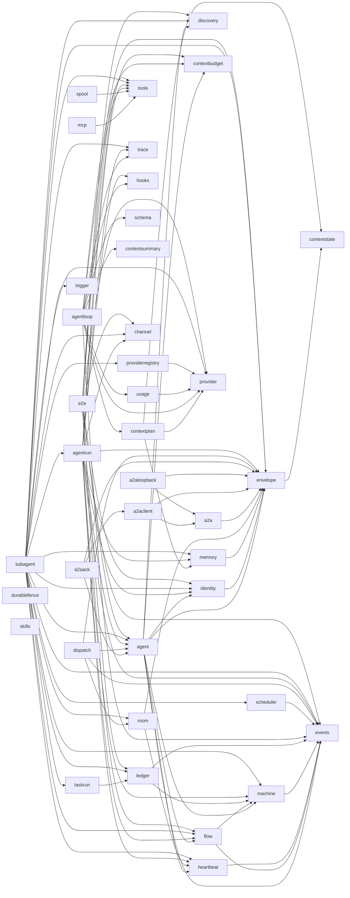
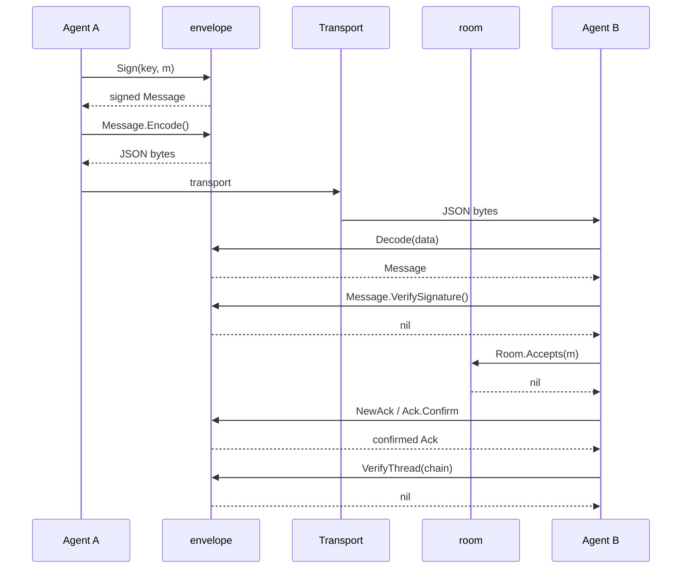

# Architecture

This document maps the modules, the message flow, the wire-format
rationale, the gate system, and the invariants the architecture
enforces. It is the single design reference for this SDK. See
[packages/envelope.md](packages/envelope.md),
[packages/room.md](packages/room.md),
[packages/machine.md](packages/machine.md),
[packages/flow.md](packages/flow.md),
[packages/identity.md](packages/identity.md),
[packages/events.md](packages/events.md),
[packages/a2a.md](packages/a2a.md),
[packages/a2aclient.md](packages/a2aclient.md),
[packages/ledger.md](packages/ledger.md),
[packages/memory.md](packages/memory.md),
[packages/provider.md](packages/provider.md), and
[packages/contextplan.md](packages/contextplan.md) for the exported
API references.

## Package map

The diagram shows the forty-three packages and the import edges
between them. An arrow points from an importer to the package it
imports. `channel`, `contextbudget`, `contextstate`, `discovery`,
`durablefence`, `events`, `hooks`, `provider`, `schema`, `skills`,
`tools`, `trace`, and `trigger` are leaves: they import no other
package in this module. `envelope` imports `contextstate` alone.
`contextplan` imports `contextstate`, `provider`, and `memory`.
`spool` imports `tools` alone. `a2aloopback` imports `a2a` and
`envelope`, the same two internal packages `a2aclient` imports.



- `envelope/` — the wire unit. It holds Message, Ack, Sign, and
  VerifyThread. `ContextRef` delegates to `contextstate.Mint`, so
  every ref in this SDK has one form. One package per concern. See
  [packages/envelope.md](packages/envelope.md).
- `room/` — standing groups. It holds the roster, the roles, and
  message admission. It also provides `StaleMembers` and the sentinel
  `ErrNoMonitor`. `StaleMembers` takes a caller-supplied
  `*heartbeat.Monitor` and reports which current roster members
  `hb.Dead` also reports; the roster, not the `Monitor`, is the source
  of truth for membership. `room` imports `heartbeat`. See
  [packages/room.md](packages/room.md).
- `machine/` — the status model. It provides `Status`, `Trigger`,
  `Guard`, `Action`, `Transition`, `InOut`, `Definition`, `New`,
  `Initial`, `Transitions`, `AllowedTransitions`, `AllowedTriggers`,
  `Validate`, `Fire`, and the JSON wire form: `Encode`, `Decode`,
  `Registry`, `NewRegistry`, and `MoveEvent`. See
  [packages/machine.md](packages/machine.md).
- `flow/` — the step graph, the sequential runner, and the parallel
  panel waves. It provides `Step`, `Panel`, `Definition`, `New`,
  `Roots`, `Run`, `Confirm`, `Admission`, `Route`, `Outcome`, `Report`,
  `Failure`, `FailureFrom`, `Checkpoint`, `Resume`, `RetryPolicy`,
  `LoopPolicy`, `LoopState`, and `LoopStateFrom`. `Step` carries an
  optional `Sub *Definition` for chaining, an `Admission` rule in
  `When`, an optional `Route` that makes it a branch step, an optional
  `Retry *RetryPolicy` that bounds and paces repeated attempts of its
  own `Fire` call, and an optional `Loop *LoopPolicy` that repeats its
  `Sub` child workflow, gated by `LoopPolicy.Guard`, before its own
  transition and `Confirm` fire; `LoopPolicy.Max` caps the iteration
  count, and zero means unbounded, bounded only by the caller's own
  `ctx`. `Run` injects a `LoopState` into `ctx` before each `Guard`
  call, readable through `LoopStateFrom`; `New` rejects a `Loop`
  combined with a nil `Sub` or panel membership. `PayloadFrom`
  resolves a step's payload against the live record at run time,
  immediately before each gated `Confirm` call. `Run` walks the
  graph in topological order. A step named in no panel runs alone and
  gates on a confirmed ack. A step named in a panel runs as part of
  that panel's wave, in a goroutine, once every member is ready; the
  wave joins its members' errors with `errors.Join`. Once every one of
  a step's needs is terminal, its `Admission` rule decides whether it
  runs or skips; a branch step's `Route` then picks which of its
  direct dependents the run keeps, and the rest skip at once. A step
  with a non-nil `Retry` retries its `Fire` call, with exponential
  backoff computed by `RetryPolicy.NextDelay`, until it succeeds or
  exhausts `MaxAttempts`; `New` rejects a `Retry` combined with `Sub`
  or panel membership. A step admitted through a need that ended
  `OutcomeFailed` (`AdmissionOnFailed`) is a fallback: it catches a
  dependency's `Fire` failure, including one that exhausted its
  retries, or a `Route` failure, and lets the run continue instead of
  aborting, reading the failed step's `Failure` through `FailureFrom`.
  A `Confirm` rejection and a missing transition row stay fatal, and
  neither retries. `Run` returns a `Report` holding the final status,
  the final record, and every resolved step's `Outcome`:
  `OutcomeSucceeded`, `OutcomeFailed`, or `OutcomeSkipped`. `Run`'s
  `onCheckpoint` hook fires a `Checkpoint` after each step or wave
  succeeds; a caller pauses a run by canceling `ctx` and resumes it
  later from the last checkpoint through `Resume`. `Checkpoint`'s
  `Failed` field preserves an already-caught failure's outcome across
  the pause, but a still-pending fallback's handler bookkeeping does
  not survive the round trip. See [packages/flow.md](packages/flow.md).
- `events/` — the in-process reaction bus. It provides `Name`,
  `Event`, `Handler`, `Bus`, `New`, `Subscribe`, and `Emit`. The
  caller owns the bus; the module has no shared bus. Event names are
  typed `Name` constants owned by each domain. See
  [packages/events.md](packages/events.md).
- `identity/` — one agent key. It provides `Identity`, `New`, `Load`,
  `Validate`, `Sign`, `Signer`, and the sentinels `ErrKeyFormat` and
  `ErrKeyInvalid`. `Sign` wraps `envelope.Sign`; `Signer` derives the
  hex public key from the private key. See
  [packages/identity.md](packages/identity.md).
- `discovery/` — the capability card. It provides `Card`, `Parse`,
  `Validate`, and `Match`. `Parse` reads a card from JSON and validates
  it. `Validate` rejects a blank name, an empty capability list, and a
  duplicate capability. `Match` compares a capability request against
  the card, case-insensitive and exact. See
  [packages/discovery.md](packages/discovery.md).
- `agent/` — the composition layer. It provides `Agent`, `New`,
  `Name`, and `Capabilities`. `New` wires an `identity.Identity`, a
  `discovery.Card`, and a `flow.Definition` into one agent. It rejects
  a nil identity, an invalid card, and a nil plan, in that order. It
  also provides the envelope-to-events translator:
  `EmitMessageDelivered`, `EmitMessageAcked`, and `EmitThreadVerified`.
  Each function verifies an already-received `envelope.Message`,
  `envelope.Ack`, or message thread, then emits one typed
  `events.Event` onto a caller-owned `events.Bus`. It also provides
  `Run` and the `AckWait` function type: `Run` drives the agent's
  bound `flow.Definition` through `flow.Run`, in-process. For each
  step `flow.Run` gates behind `Confirm`, `Run` signs an
  `envelope.Message`, emits `MessageDeliveredEvent`, calls the
  caller-supplied `AckWait`, and emits `MessageAckedEvent` once the
  ack confirms. An `AckWait` that wraps `ErrEscalated` routes the step
  back to the caller. `Run` takes one trailing, optional
  `*heartbeat.Monitor` parameter. A non-nil `Monitor` beats one id,
  `a.id.Signer()+":"+threadID`, right before each gated step's
  `AckWait` call, and forgets it once, on every return path. A panel
  step reaches no beat call. `Run` never reads `Dead` itself; an
  external caller holding the same `Monitor` polls `Dead` on its own
  schedule. `Run` also takes one trailing, optional `room string`
  parameter. A non-empty `room` makes `Run` stamp it onto
  `Message.Room` before it signs each gated step's message; an empty
  `room` leaves `Message.Room` at the zero value. `Run` also takes one
  trailing, optional `*contextbudget.Limits` parameter. A non-nil
  `budget` runs `budget.Validate()` once, at the same point `Run`
  checks `wait`, `bus`, and `threadID`; an invalid budget returns its
  wrapped `Validate` error. A non-nil, valid `budget` makes
  `confirmStep` check `budget.Fits`, right before each gated step's
  `AckWait` call and before the heartbeat beat, against the cumulative
  byte total of every message built so far plus the step about to run.
  A `Fits` failure returns `ErrOverBudget`, wrapping the step ID,
  without beating, waiting, or emitting `MessageAckedEvent` for that
  step. A panel step reaches no `Fits` check either. `agent` imports
  `envelope`, `events`, `machine`, `heartbeat`, and `contextbudget`;
  none of those five packages imports `agent` or any of the other
  four. `provider`, `tools`, `mcp`, `ledger`, and `memory` compose
  around `Run` through `AckWait` and plan construction, not through a
  direct import edge; the flowchart above draws no new arrow for them.
  See [packages/agent.md](packages/agent.md).
- `heartbeat/` — a leaf primitive. It provides `Monitor`, `New`,
  `Beat`, `Alive`, `Dead`, `Forget`, and the typed event name
  `MissedEvent`. `Monitor` tracks liveness by time: it records the
  last beat per id and reports which ids have gone silent past a
  fixed timeout. `agent` and `room` both import it: `agent.Run`'s
  optional step-liveness heartbeat, and `room.Room.StaleMembers`'s
  roster-staleness check. It imports `events` only, for the
  `MissedEvent` constant. See
  [packages/heartbeat.md](packages/heartbeat.md).
- `a2a/` — the A2A v1.0 mapping. It provides `Part`, `Mapped`,
  `ToPart`, and `FromPart`. `ToPart` validates an `envelope.Message`
  and encodes it into a `Part`. `FromPart` decodes a `Part` back into
  a `Message`, with the caller-supplied `ContextID`/`MessageID`
  overriding any value embedded in the part. `a2a` imports `envelope`
  only; it carries no network call. See [packages/a2a.md](packages/a2a.md).
- `a2aclient/` — the a2a-go client adapter. It provides `Client`,
  `New`, `Close`, `TaskHandle`, `State`, and `Send`, `Status`, and
  `Result`. `Send` maps a signed message through `a2a.ToPart` and
  sends it as a remote task; `Status` polls the task's state; `Result`
  maps the output back through `a2a.FromPart` and re-verifies the
  signature. `a2aclient` imports `a2a` and `envelope`. It is one of
  two packages in this module allowed to import the third-party
  `github.com/a2aproject/a2a-go` and `google.golang.org/grpc`, the
  dial dependency `a2a-go`'s gRPC transport needs; this is the
  module's first external network call. `a2aloopback` is the other.
  See [packages/a2aclient.md](packages/a2aclient.md).
- `a2aloopback/` — a gRPC A2A loopback test fixture. It provides
  `Loopback`, which starts a real A2A server on a 127.0.0.1 port and
  returns the address and a stop function. `a2aloopback` imports `a2a`
  and `envelope`, plus the same third-party `a2a-go`/`grpc` exception
  `a2aclient` carries, scoped to the server-side packages a production
  client never needs. It follows `durablefence`'s convention: no
  production package may import it; only `a2aclient`'s own tests and
  `a2aack`'s tests do.
- `a2aack/` — the remote step ack. It provides `Options`,
  `Options.Validate`, `Remote`, `Wait`, and sentinels. `Wait` returns
  an `agent.AckWait` that sends a gated step as a remote task, polls
  `Status`, fetches `Result`, re-verifies its signature, and builds a
  confirmed ack keyed off the sent message. `a2aack` imports
  `a2aclient`, `agent`, and `envelope`. It carries no a2a-go import of
  its own. See [packages/a2aack.md](packages/a2aack.md).
- `dispatch/` — the NDJSON envelope endpoint. It provides `Handler`,
  `Options`, `Options.Validate`, `New`, `Endpoint`, `Endpoint.Handler`,
  `Send`, `SendResult`, and sentinels. `Endpoint.Handler` answers POST
  requests whose body is newline-delimited `envelope.Message` JSON: it
  runs the receive ladder per line — `Decode`, `VerifySignature`,
  `Room.Accepts`, resolve, handle, `NewAck`, `Confirm`, `Encode` — and
  answers with one newline-delimited ack or JSON error object per
  line. `EmitMessageDelivered` and `EmitMessageAcked` are best-effort
  diagnostics called after their point in the ladder; their error
  return never fails a line. `Send` posts a batch of signed messages
  as one NDJSON request and parses the reply into one `SendResult` per
  line, in order. `dispatch` imports `agent`, `envelope`, `events`,
  and `room`; it carries no third-party or network-transport import
  beyond the standard library `net/http`. See
  [packages/dispatch.md](packages/dispatch.md).
- `agentrun/` — the config-struct composition layer over `agent.Run`.
  See [packages/agentrun.md](packages/agentrun.md).
- `taskrun/` — the ledger admit, claim, run, complete ceremony around
  one work func. See [packages/taskrun.md](packages/taskrun.md).
- `subagent/` — the SDK's blocks as tools. `AsTool` wraps a built
  runner as a spawnable subagent tool behind a depth guard, `RunAll`
  joins concurrent spawns, eleven internal tools expose the blocks, and
  a signed-message mailbox carries both directions between
  orchestrators, subagents, and humans. See
  [packages/subagent.md](packages/subagent.md).
- `e2e/` — the end-to-end scenario harness and suite. Each scenario
  wires real high-level blocks together and asserts one full run's
  outputs. See [packages/e2e.md](packages/e2e.md).
- `agentloop/` — a second composition path beside `flow`: a
  tool-calling loop over a `provider.Completer` and a `tools.Registry`.
  `New` validates `Options` and calls `Definitions` once; `Run` offers
  the cached tool definitions, calls `Registry.RunScoped` for each
  model-requested call, appends the results, and repeats until the
  model asks for no more tools or a bound trips (`MaxIterations`,
  `MaxCallsPerTurn`, `MaxTotalTokens`, `Budget`, or ctx cancellation).
  A wired `Hooks` registry fires `PointPreTool` and `PointPostTool` per
  tool call and `PointStop` once, on every return path. A model-chosen
  call's arguments run through a `schema`-compiled validation gate
  before `DecodeArguments`, and a wired `Options.Audit` receives one
  `AuditRecord` per completion and per tool call, keeping `agentloop`
  envelope-agnostic: a caller signs its own audit trail from those
  records, outside the block, the way `agent.confirmStep` signs `flow`
  steps. A non-nil `Options.Window` plans every iteration against a
  token budget: under the trigger the history passes through; at or
  above it, `contextplan.Compact` plus one `contextsummary` call
  rebuild the history around an injected summary message, and one
  `Calibrated.Observe` after every turn keeps the estimate honest. A
  `provider.ErrPromptTooLong` rejection recovers once through a
  one-percent trigger, a bounded target, one `CompactionNotice`, and
  exactly one retry. `agentloop` imports `provider`, `tools`,
  `trace`, `hooks`, `usage`, `events`, `contextbudget`, `schema`,
  `contextplan`, and `contextsummary`; it never imports
  `subagent`. See [packages/agentloop.md](packages/agentloop.md).
- `tools/` — the tool registry. It provides `Tool`, `Registry`,
  `InOut`, `Out`, `New`, `Add`, `Get`, `Remove`, `Run`, and `Tools`. A
  `Tool` is a named action; a `Registry` resolves one by name and runs
  it. `Add` and `Remove` mirror `room.Room`'s membership symmetry.
  `Tools` returns every registered `Tool`, sorted by name. It also
  provides `ExecutionClass`, `ExecutionProfile`, `ProfiledTool`,
  `ResultBudgetTool`, `PrivilegedTool`, `SchemaTool`, `SchemaOf`,
  `Scope`, `ScopeOptions`, `NewScope`, and `RunScoped`: optional
  execution-risk and schema markers a `Tool` may implement, and a
  `Scope` that narrows which tools a run may invoke. `SchemaTool`
  publishes a parameter schema and decodes model-supplied arguments;
  `agentloop.Definitions` skips a tool that does not implement it.
  `ScopeOptions.Approve` and `ScopeOptions.ApprovalThreshold`
  add a synchronous approval gate: `RunScoped` calls `Approve` with a
  `ToolCall` after `Allowed` passes and before it runs the tool,
  returning `ErrToolDeclined` for a decline. `tools` imports no other
  package in this module; `mcp`, `spool`, and `agentloop` import
  `tools`. See [packages/tools.md](packages/tools.md).
- `spool/` — a principal-scoped grant store for oversized content. It
  provides `Spool`, `NewSpool`, `Spool.Spool`, `Spool.Load`,
  `ContentStore`, `WithPrincipal`, `PrincipalFrom`, and `SpoolTool`.
  `Spool.Spool` writes content to a caller-supplied `ContentStore`,
  grants one principal the right to read it back, and returns a
  bounded view plus a reference. `NewSpool`'s `maxGrantBytes` budget
  evicts the oldest grants, by insertion order, once a new grant would
  exceed it. `SpoolTool` wraps a `tools.Tool`: a string result over
  `maxBytes` spools instead of returning in full, and the wrapper
  forwards `ExecutionProfile`, `MaxResultBytes`, `Privileged`, and
  `SchemaTool` from the wrapped tool whenever it implements them.
  `spool` imports `tools` only. See [packages/spool.md](packages/spool.md).
- `ledger/` — the durable-task-admission primitive. It provides
  `Ledger`, `New`, `Admit`, `Claim`, `Renew`, `Release`, `Takeover`,
  `Complete`, `State`, `Blocked`, `Snapshot`, `Encode`, `Decode`,
  `Restore`, the `Store` interface, and `MemStore`. `Admit` dedupes a
  task by `IdempotencyKey` and a sequence watermark. `Claim` and
  `Takeover` read `LeaseUntil` against a caller-supplied `now` as the
  only staleness signal; a `FenceToken` bumped on every claim fences a
  dispossessed owner's late write. `Complete` on a failed status walks
  the `Needs` graph and marks every transitive dependent
  `StatusBlocked`. `ledger` reuses `machine.Status` for its five task
  states and imports `events` for its typed event names; it imports
  no other internal package. Behind the `ledger_sqlite` build tag,
  `ledger` also provides `SQLiteStore`, `NewSQLiteStore`, and `Close`:
  a durable `Store` backed by `modernc.org/sqlite`, next to `MemStore`.
  The default build never compiles it, so a `MemStore`-only caller
  pays no dependency cost. See [packages/ledger.md](packages/ledger.md).
- `durablefence/` — a test-only conformance kit. It provides
  `Scenario`, `Validate`, `ErrIncompleteScenario`, seven `Check*`
  functions, and `RunAll`. A caller wires its own claim, takeover,
  mutate, release, and fence-reading calls into a `Scenario` literal
  and runs `RunAll` to prove the claim-and-fence invariants hold,
  including a concurrent takeover-versus-mutate race a sequential test
  cannot reach. `durablefence` is a leaf with no import edge to or
  from any other package in this module; no production code may import
  it. `ledger/ledger_test/scenario_test.go` wires it against `Ledger`.
- `memory/` — the content-addressed context store. It provides
  `Store`, `New`, `Put`, `Get`, and the sentinels `ErrNoBudget`,
  `ErrBudgetExceeded`, and `ErrUnknownRef`. `Put` computes a blob's
  ref with `envelope.ContextRef` and stores it under a fixed byte
  budget; a blob that would exceed the budget evicts the
  oldest-inserted blobs, in insertion order, until it fits. `memory`
  imports `envelope` only, for `ContextRef`. See
  [packages/memory.md](packages/memory.md).
- `mcp/` — the MCP tool-calling client. It provides `Transport`,
  `NewStdioTransport`, `NewStreamableHTTPTransport`, `ClientInfo`,
  `ProgressHandler`, `ClientOptions`, `Client`, `Connect`, `Close`,
  `ListTools`, `CallTool`, `CallToolWithProgress`, `ContentBlock`,
  `CallResult`, `RegisterAll`, and `ErrClosed`. A mapped tool
  implements `tools.SchemaTool`, so `agentloop.Definitions` offers it.
  `Connect` opens a session over a local subprocess or a remote
  streamable HTTP endpoint, through the official MCP Go SDK's own
  client; `ListTools` and `CallTool` map the server's tools and
  results onto `tools.Tool` and `tools.Out`. `mcp` imports `tools`
  internally. It is the second package, after `a2aclient`, allowed to
  carry a third-party import: `github.com/modelcontextprotocol/go-sdk`,
  the official MCP Go SDK. See [packages/mcp.md](packages/mcp.md).
- `schema/` — the JSON Schema compile/validate/corrective-message
  primitive. It provides `Compiled`, `Compile`, `Validate`,
  `Corrective`, `MaxSchemaBytes`, `MaxSchemaDepth`, `MaxPayloadBytes`,
  `MaxCorrectiveBytes`, and the sentinels `ErrAdmission`, `ErrCompile`,
  `ErrMalformedPayload`, and `ErrValidation`. `Compile` admits and
  compiles a JSON Schema document; `Validate` checks a JSON payload
  against it; `Corrective` renders a bounded, model-facing message on
  a validation failure. `schema` imports no other package in this
  module; it is the fourth package, after `a2aclient`, `mcp`, and
  `ledger`, allowed to carry a third-party import:
  `github.com/santhosh-tekuri/jsonschema/v6`.
- `contextbudget/` — a leaf primitive. It provides `Limits`,
  `Validate`, and `Fits`. `Limits` caps one model call's context by
  byte count and event count; a zero field means no cap for that
  dimension. `Validate` rejects a negative `MaxBytes` or `MaxEvents`.
  `Fits` reports whether a candidate byte and event total both stay
  at or under their caps; it keeps no running total of its own.
  `contextbudget` imports no other package in this module; `agent`
  imports it for `Run`'s optional budget check.
- `contextstate/` — the durable context contract and the canonical
  content-reference minter. It provides `HashPrefix`, `Digest`,
  `Mint`, `IsRef`, the contract types (`ContentRef`,
  `NewContentRef`, `PayloadRecord`, `Reassemble`, `SourceID`,
  `SourceRange`, `SourceEvent`, `Revision`, `BindingRevision`,
  `CheckpointID`, `Checkpoint`, `Session`), `CommitRequest` with
  `NewCommitRequest` and `Validate`, `Limits` with `Validate`, and
  the `MemStore` with `New`, `Put`, `Get`, `Checkpoint`, and
  `Session`. `Mint` mints the `sha256:`-prefixed ref; a reused
  `OperationID` with an equal request is a no-op success, and with a
  different request it wraps `ErrCheckpointConflict`. `envelope`
  imports it: `ContextRef` delegates to `Mint`, so every ref in this
  SDK has one form. See [packages/contextstate.md](packages/contextstate.md).
- `provider/` — the model provider interface. It provides `Completer`,
  `RunTurn`, `Role` and its constants, `Message`, `Message.Validate`,
  `ToolDefinition`, `ToolCall`, `Usage`, `Request`, `Request.Validate`,
  `Response`, `Chunk`, `Chunk.Validate`, `ContextAccountant`,
  `ReasoningPolicy`, `TokenEstimator`, `ReasoningEffort` and its four
  level constants, `ReasoningDialect`, `ToolChoice` and its two
  constants, `CacheStyle` and its three constants, `CacheUsage`,
  `WebSearchResult`, `ReasoningBlock`, `RedactBlock`,
  `ReasoningEventKind`, and the sentinels `ErrToolCallIDUnexpected`,
  `ErrToolCallIDRequired`, `ErrUnknownRole`, `ErrToolCallsUnexpected`,
  `ErrChunkErrDoneConflict`, `ErrStreamClosedEarly`,
  `ErrNameUnexpected`, `ErrNameInvalid`, `ErrPromptTooLong`,
  `ErrReasoningContentUnexpected`, and `ErrToolChoiceInvalid`.
  `Message` carries `ToolCalls` on an assistant turn and
  `ReasoningContent` on an assistant turn only; `RunTurn` copies
  `ToolCalls` onto `Response.Message.ToolCalls` as well as
  `Response.ToolCalls`, and copies the drained `ReasoningDelta` text
  onto `Response.Message.ReasoningContent`. `Request` carries the
  request controls a hosted-model client needs: `Temperature` and
  `MaxTokens` as pointers, `ToolChoice`, `Timeout`, `SessionID`,
  `DisableProviderReplay`, `ReasoningEffort`, and `ReasoningDialect`.
  `Response` and the terminal `Chunk` carry `CacheUsage` and
  `WebSearch` for provider-side cache and search accounting.
  `Completer` has no
  implementation in this SDK; a caller supplies its own concrete type.
  `RunTurn` validates `Request` once, then validates every message,
  dispatches on `Request.Stream`, and aggregates a streamed `Chunk`
  sequence into one `Response`. `ReasoningEventKind` is the
  `contextstate.SourceEvent.Kind` value a reasoning trace carries;
  `RedactBlock` clears a `ReasoningBlock`'s content and marks it
  redacted. `provider` imports no other package in this module. See
  [packages/provider.md](packages/provider.md).
- `contextplan/` — fits one durable session into a bounded provider
  request. It provides `Planner` with `NewPlanner` and `Plan`,
  `Window` with `Validate` and `Budget`, `PlanResult`, `Elision`,
  `ElisionReason` and its three constants, `Calibrate` and
  `Calibrated`, `IsReasoningEvent`, `StubContent`, and the sentinels
  `ErrNilStore`, `ErrNilCache`, `ErrMaxTokensNotPositive`,
  `ErrReserveNegative`, `ErrReserveTooLarge`, and `ErrNilSession`.
  `Plan` walks a `contextstate.Session`'s source events newest to
  oldest, keeping each one until `Window.Budget` fills, then stubs or
  drops the rest; a reasoning event, per `IsReasoningEvent`, never
  enters the built `provider.Request`. `Calibrated` wraps a
  `provider.TokenEstimator` with an EWMA correction factor `Observe`
  updates after each turn, guarded by a mutex for concurrent use. The
  compaction surface adds `Compaction` with `Validate`, `Compact`,
  `CompactResult`, `CompactTrigger` and `CompactTarget`, the
  retention and tail-fill constants, and the `Compact` sentinels:
  `Compact` applies the trigger check and a fixed retention set over
  one message list, pure, with no LLM call, and mints the
  `context-compact-v1` idempotency key through `contextstate.Mint`.
  `contextplan` imports `contextstate`, `provider`, and `memory`. See
  [packages/contextplan.md](packages/contextplan.md).
- `contextsummary/` — the LLM summarizer for compaction. It provides
  `Summary` with `Validate` and `Render`, `SummaryMessage`,
  `TokenEstimate`, `Summarizer` with `NewSummarizer` and `Summarize`,
  the bounds `MaxFieldBytes`, `MaxItems`, `MaxExcerptTotalBytes`, and
  `SummaryTimeout`, the injected message name `SummaryMessageName`,
  and the sentinels `ErrNilCompleter`, `ErrNoMessages`,
  `ErrInvalidReply`, and `ErrCallFailed`. One summarizer call is one
  bounded `provider.Completer` call: excerpts cap the input, a 20
  second timeout caps the duration, and strict decoding plus
  `Summary.Validate` cap the accepted output. A summary failure is a
  caller-visible error; no structural fallback exists. `contextsummary`
  imports `provider` only. See
  [packages/contextsummary.md](packages/contextsummary.md).
- `longtermmemory/` — the tiered long-term memory store. It
  provides `Entry` with `Validate`, the `Verdict` set, `Result`,
  `Query`, `Store` with `New`, `Save`, `Search`, `Count`,
  `PromoteToCore`, `CoreEntries`, `Delete`, and `CoreFrame`, the
  bounds `CoreTierCap` (24), `DefaultMaxEntries` (500),
  `DefaultMaxSearchResults` (8), `DefaultFrameBytes` (4 KiB), and
  `ConsolidateLoadFactor` (0.8), the frame constants `FrameAdvisory`,
  `FrameOpenTag`, and `FrameCloseTag`, and the sentinels
  `ErrEntryNotFound`, `ErrCoreTierFull`, `ErrStoreFull`,
  `ErrQueryRequired`, and `ErrScopeRequired`. Entry ids are
  content-addressed over every field; consolidation at the load
  factor runs one near-duplicate merge pass (Jaccard at or above
  0.82) and then oldest-archive eviction, never touching core rows;
  `CoreFrame` renders the core tier as a bounded block whose entry
  text is HTML-escaped against the frame tags, so agent-writable text
  cannot close the block early. A leaf: no internal imports, standard
  library only. See
  [packages/longtermmemory.md](packages/longtermmemory.md).
- `providerregistry/` — the multi-provider routing package. It
  provides `Registry`, `New`, `Register`, `Get`, `Names`, `Retryable`,
  `Route`, and the sentinels `ErrNilCompleter`, `ErrBlankName`,
  `ErrDuplicateName`, `ErrUnknownName`, `ErrEmptyOrder`, and
  `ErrAllFailed`. `Registry` holds named `Completer` values behind the
  same mutex shape `tools.Registry` uses. `Route` walks a
  caller-chosen order of names through `provider.RunTurn` and falls
  through to the next name only when the caller's `Retryable`
  predicate approves the failure. `providerregistry` imports
  `provider` only. See
  [packages/providerregistry.md](packages/providerregistry.md).
- `usage/` — the per-session usage accounting package. It provides
  `Accumulator`, `New`, `Record`, `Total`, `Reset`, `WrapCompleter`,
  and the sentinels `ErrBlankSessionID`, `ErrNilAccumulator`, and
  `ErrNilCompleter`. `Record` sums one `provider.Usage` call's four
  fields onto the running total keyed by a caller-supplied session
  identifier, guarded for concurrent access; `Total` reads the current
  sum, and `Reset` clears it. `usage` imports `provider` only, for the
  `Usage` type. See [packages/usage.md](packages/usage.md).
- `channel/` — a leaf primitive. It provides `Question`,
  `Question.Validate`, `Answer`, `Answer.Validate`, `Notifier`, and
  the sentinels `ErrEmptyID`, `ErrEmptyRecipient`, `ErrEmptyPayload`,
  and `ErrEmptyQuestionID`. `Notifier` is a caller-implemented func
  type that asks a question and returns a typed `Answer`; `channel`
  ships no concrete transport. `channel` imports no other package in
  this module. See [packages/channel.md](packages/channel.md).
- `trigger/` — a leaf primitive. It provides `Condition`, `Action`,
  `Registry`, `New`, `Add`, `Remove`, `Fire`, and the sentinels
  `ErrBlankName`, `ErrNilAction`, `ErrDuplicateName`, `ErrUnknownName`,
  and `ErrConditionNotMet`. A `Registry` maps a name to one `Condition`
  and one `Action`; `Fire` evaluates the named `Condition` and, when
  true, calls the `Action`. `Condition` matches `machine.Guard`'s
  signature; `Action` is shaped to match `scheduler.Job`'s signature.
  `trigger` imports no other package in this module. See
  [packages/trigger.md](packages/trigger.md).
- `hooks/` — a leaf primitive. It provides `Point`, `PointPreTool`,
  `PointPostTool`, `PointStop`, `Point.Validate`, `Point.String`,
  `Handler`, `Registry`, `New`, `Add`, `Remove`, `Fire`, and the
  sentinels `ErrBlankName`, `ErrNilHandler`, `ErrDuplicateName`, and
  `ErrVetoed`. A `Registry` groups named handlers by `Point`;
  `Fire` runs them in registration order and stops at the first
  veto. Unlike `events.Bus`, `Fire` propagates the decision: a veto
  or a handler error short-circuits the chain and returns to the
  caller. `hooks` imports no other package in this module. See
  [packages/hooks.md](packages/hooks.md).
- `skills/` — a leaf primitive. It provides `Skill`, `Skill.Validate`,
  `Registry`, `New`, `Add`, `Get`, `Remove`, `Names`, `Match`, and the
  sentinels `ErrBlankName`, `ErrBlankInstructions`, `ErrBlankTrigger`,
  `ErrDuplicateTrigger`, and `ErrDuplicateName`. A `Skill` is read, not
  called: it carries instructions text, a trigger-phrase list, and the
  tool names it expects available. `Match` compares a query against
  every registered skill's `Triggers`, case-insensitively. `skills`
  imports no other package in this module. See
  [packages/skills.md](packages/skills.md).
- `scheduler/` — the invoke-on-schedule primitive. It provides `Job`,
  `Schedule`, `Every`, `At`, `Scheduler`, `New`, `Add`, `Remove`,
  `Run`, `JobFailedEvent`, and the sentinels `ErrBlankID`,
  `ErrNilSchedule`, `ErrNilJob`, and `ErrDuplicateID`. `Run` fires each
  due `Job` in its own goroutine on a wake-channel sleep loop and
  emits `JobFailedEvent` on a caller-supplied `*events.Bus` when a
  `Job` fails. `scheduler` imports `events`. See
  [packages/scheduler.md](packages/scheduler.md).

The machine and flow packages compose. Flow imports machine for each
step's status transitions and for `Run`'s status walk. The machine
package imports events for its typed `MoveEvent` constant.
The events package imports nothing; it is a leaf.
The identity package imports envelope only; it wraps `envelope.Sign`.
The a2a package imports envelope only; it holds no other edge.
The a2aclient package imports a2a and envelope. It also imports the
third-party github.com/a2aproject/a2a-go, the one exception to this
module's standard-library-only rule; see AGENTS.md's Rules section.

The root holds no Go code. New concerns get new subpackages. The
import policy in `policy/layers.json` states which package may import
which; `scripts/check_deps.py` enforces it.

## Message flow

The wire form is the JSON bytes that Encode and Decode handle.



1. **Sign.** `envelope/sign.go`, `Sign(key, m)`: sets Signer and
   Signature. The signature covers the canonical JSON of every field
   except itself.
2. **Encode.** `envelope/message.go`, `Message.Encode`: validates, then
   marshals to JSON. An invalid message cannot cross the wire.
3. **Transport.** Out of scope for this SDK. The wire form is the JSON
   bytes from Encode and to Decode.
4. **Decode.** `envelope/message.go`, `Decode(data)`: parses JSON, then
   validates. Unknown fields are ignored for forward compatibility.
5. **Verify.** `envelope/sign.go`, `Message.VerifySignature`: checks
   the ed25519 signature against the embedded Signer key.
6. **Room admission.** `room/room.go`, `Room.Accepts`: checks the room
   name, the signature, and the membership of the signer and the
   recipients.
7. **Ack.** `envelope/ack.go`, `NewAck`, `Ack.Confirm`, `Ack.Correct`:
   the semantic-ack flow. Only a confirmed Ack means the receiver may
   act.
8. **Thread chain.** `envelope/thread.go`, `VerifyThread`: checks the
   hash chain and rejects repeated message IDs.

## Why the envelope is shaped this way

Schema version: **v1**. Two language models that exchange plain
natural language have four recurring failure modes: no epistemic
typing ("the API returns JSON" and "I assume the API returns JSON"
look identical); silent misunderstanding (no acknowledgment of
meaning, so a 15%-wrong parse only shows in the final output); context
that is not addressable (each exchange re-transmits or assumes shared
context and drifts); and no provenance (a model claim, a tool result,
and an untrusted document arrive in the same register — a
prompt-injection surface). Bandwidth and parsing are not the
bottleneck; both sides are trained on ambiguous human text.

Existing multi-agent protocols do not close these gaps. A2A
standardizes capability discovery, task lifecycle, and transport, with
no epistemic typing and no semantic acknowledgment; it is routing and
task management, and this envelope's message semantics compose with
it rather than compete. A cross-protocol governance survey (across
MCP, A2A, ACP, ANP, and ERC-8004) found voting, dissent preservation,
and human escalation universally absent, and audit treated as a
substrate property, not a protocol primitive; this envelope takes
three cheap primitives from that gap: `challenge` (deliberation),
`escalate` (human escalation), and a tamper-evident hash chain per
thread (audit). Research on why models default to natural language
documents cascading semantic loss (the internal-state-to-language
mapping is lossy, so reconstruction error compounds per relay hop),
"lost-in-conversation" (no task boundaries), and pseudo-execution
(an agent reports done without doing); this envelope answers with
explicit thread boundaries (`thread_id`), a capped relay count
(`max_hops`), and a semantic ack that catches reconstruction error
after one hop instead of after a cascade.

Two alternatives were rejected. A pure formal language (logic, a
binary format) throws away what models do best and adds translation
errors at both ends. Pure natural language is the status quo: no
validation, no provenance, silent drift. Activation- or tensor-level
exchange between models trades the human-readable debugging channel
for same-family-weights fidelity, out of scope for a portable
protocol.

The design puts machine-checkable metadata around a natural-language
payload:

```json
{
  "version": "v1",
  "id": "msg-1",
  "room": "platform-team",
  "thread_id": "task-42",
  "to": ["agent-b", "agent-c"],
  "in_reply_to": "msg-0",
  "intent": "assert | query | request | challenge | retract | escalate",
  "epistemic": "verified | inferred | assumed | untrusted-input",
  "confidence": 0.85,
  "context_refs": ["sha256:..."],
  "prev_hash": "sha256:...",
  "provenance": {"source": "tool:grep", "chain": ["agent-a"],
    "evidence": ["sha256:..."]},
  "max_hops": 3,
  "cost_budget": 4000,
  "ack_required": true,
  "payload": "natural language content",
  "signer": "<hex ed25519 public key>",
  "signature": "<hex ed25519 signature>"
}
```

- **Natural-language payload.** Structure goes where structure pays:
  the metadata. The content stays in the format both sides parse
  best.
- **Epistemic label as a first-class field.** Errors in multi-agent
  systems come mostly from confidence laundering: a guess passes
  through two hops and comes out as a fact. `verified` requires a
  named source plus evidence content refs, so the strongest label
  points at artifacts a receiver can hash-check, not a bare claim.
- **Context by reference.** `ContextRef(content)` computes a `sha256:`
  address. Shared context is deduplicated, and "do we talk about the
  same thing" becomes checkable. Context window is the one resource
  that is actually scarce.
- **Provenance chain.** Security, not bookkeeping. The
  `untrusted-input` label tells the receiver to hold the content at
  arm's length, not treat it as an instruction.
- **Thread boundary.** `thread_id` groups one conversation or task.
  Required, since unnamed threads are how agents lose the plot over
  long exchanges.
- **Addressing: 1-to-1, multicast, rooms.** `signer` is the sender.
  `to` lists recipients: one entry is 1-to-1, several are multicast,
  empty is broadcast to the room. `room` names a standing group;
  threads live inside rooms. Membership lives in the `room` package: a
  moderator-gated roster with roles, and `Room.Accepts` gates a
  message on signer and recipient membership. The envelope carries the
  address; `room` carries the roster. `agent.Run` may stamp a
  caller-chosen room name onto each step message before signing, so a
  plan whose caller supplies one produces messages a `room.Room` can
  admit.
- **Tamper-evident audit.** `prev_hash` links each message to the
  `Hash()` of the previous message in the thread. Reordering,
  deletion, or insertion breaks the chain and is detectable at the
  cost of one hash per message. `VerifyThread` also rejects a repeated
  message ID: `id` stays unique within its `thread_id`, so a replayed
  or duplicated message cannot enter the chain.
- **Hop cap.** `max_hops` limits how many relays a message may pass
  through, checked against the provenance chain length. Semantic error
  accumulates per hop; unbounded relay is unbounded drift.
- **Human escalation.** `escalate` routes a decision to a human or
  higher authority, a primitive absent from the surveyed protocols.
- **Cost budget.** Lets the sender cap reply cost so the receiver can
  pick a compression level.
- **Authentication.** `Sign`/`VerifySignature` (ed25519) authenticate a
  message: the signature covers the canonical JSON of every field
  except itself, so any post-signing change fails verification. The
  hash chain gives tamper-evidence for the thread; the signature gives
  authorship for each message. Trust policy (which signers to accept)
  stays with the caller.
- **Schema version.** `version` is validated against the one supported
  value. Unknown JSON fields are ignored on decode, so a newer sender
  can add fields without breaking an older receiver.

`Message.Validate` enforces every rule stated above as a field
comment: `version` equals the supported value; `id` is set and
differs from `in_reply_to`; `thread_id` is set; `challenge` and
`retract` require `in_reply_to`; `verified` requires
`provenance.source` and at least one evidence ref; `confidence` sits
inside `[0, 1]`; context refs and `prev_hash` are canonical
(`sha256:` plus 64 lowercase hex chars, comparable by string
equality); `max_hops`, when set, is not exceeded by the provenance
chain; every evidence ref is a canonical sha256 address; `signer` and
`signature` come as a pair, in canonical hex form; `payload` is
non-empty. `VerifyThread` adds the thread-level rule: no `id` repeats
within one thread.

**Semantic acknowledgment** is the one rule that matters more than any
field. For any `request`, and for any message with
`ack_required: true`, the receiver replies with a compressed
restatement of what it understood before it acts; the sender confirms
or corrects. This converts silent misunderstanding into a cheap
two-round exchange, the same move a careful human engineer makes
("so you want X, not Y — right?"), and it measures reconstruction
error after one hop instead of after a cascade.

```go
ack, _ := envelope.NewAck(msg, "agent-b", "You want X, not Y.") // pending; built by receiver
ack = ack.Confirm()                                              // sender accepts
ack = ack.Correct("Y is out of scope; only X.")                  // or sender fixes
```

Only a `confirmed` ack means the receiver may act. In a group, each
recipient sends its own ack and `from` tells them apart. A request to
a room is not actionable until every addressed recipient has a
confirmed ack; that rule belongs to the caller, not the envelope.

`prev_hash` forms a linear chain, which assumes one writer appends to
a thread at a time. Two parties taking turns satisfy this; a busy room
does not, since two agents can both append to the same parent and the
chain forks. The rule is: a thread has serialized appends, enforced by
whoever owns the transport (last-hash-wins locking, a sequencer, or a
thread owner). A multi-parent DAG (`prev_hash` as a list, git-style)
is the known upgrade path for a use case that needs concurrent
writers.

Deliberately omitted, because these belong to other layers, not the
message envelope: capability discovery (a registry concern — the
`discovery` package defines its own minimal card shape instead of the
A2A Agent Card format); streaming, push, and task lifecycle (transport
and session concerns — `a2a` maps an envelope message onto an A2A v1.0
message part and back with no task-lifecycle or transport claim, and
`a2aclient` sends that mapped part to a remote agent and polls its
status over `a2aproject/a2a-go`'s gRPC transport, adding no
message-semantics rule of its own); voting and dissent preservation
(governance-layer primitives beyond the two-party `challenge` and
`escalate`); identity registries or DID resolution (a signature proves
a message came from the holder of a key, not who that key belongs to
organizationally — a registry decision this SDK does not make).

Known limits: epistemic labels are self-reported, so a model that
hallucinates can mislabel the hallucination as `verified` — the labels
create auditable claims about truth, not truth itself, and only the
provenance fields (did the tool call happen?) are mechanically
checkable, not confidence. Acks cost a round trip, overhead for
nothing on a trivial message, so the `ack_required` threshold needs
care. Two colluding, identical models can agree on a shared
misunderstanding faster than a human catches it; a different model on
the receiving side is arguably a protocol-level feature, and
`escalate` is the designed escape hatch. Trust policy is out of band:
signatures authenticate the key holder, but which signers a receiver
accepts is the caller's decision, with no revocation or key-rotation
story yet. A status transition precedes its ack check: the `flow`
runner fires a step's status transition, then waits on the step's ack;
a rejected or escalated ack halts the walk but does not roll the
status or its record back to the pre-step value. `agent.Run` signs
each step's message, waits for a confirmed ack through a
caller-supplied `AckWait`, and only advances the walk once the ack
confirms.

## Gate system

The gates are mechanical. They run in `make verify` and, on a subset,
in the pre-commit hook.

- `scripts/` — the gates: check_docs, check_structure, check_deps,
  check_plan, check_prose, check_api, check_gomod,
  check_semgrepignore, check_labels, check_names,
  check_semgrep_probes, check_mutation, and api_surface (Go).
- `semgrep/` — the pattern rules: no panic or exit in packages,
  stdlib-only imports, centralized constants, no hardcoded secrets, no
  suppression markers, no drift markers.
- `.githooks/pre-commit` — runs `make verify-fast` on the staged
  snapshot. The worktree never leaks into the commit.

`make verify-fast` runs gofmt, vet, one test pass, the python gates,
the semgrep scan, and the suppression-marker scan. `make verify` runs
everything verify-fast runs, plus the coverage floor, the semgrep
probe suite, and `check_mutation.py --probe`. `make verify-ledger-sqlite`
is a separate, explicit command for `ledger`'s
`ledger_sqlite`-build-tag-gated `SQLiteStore` code; it runs outside
`make verify` since the default build never compiles that code, and it
holds the tag-gated `ledger` package to the same 85% coverage floor.
`make mutation` runs a full per-package mutation sweep on demand: it
applies text-level operator mutations to a named package's source, runs
that package's tests per mutant, and checks the kill rate against the
package's stored floor in `scripts/mutation_denylist/<pkg>.json`. It
never runs inside `verify` or `verify-fast`, since a full sweep costs
minutes.

GitHub Actions CI runs `make verify` on every push and pull request to
`main`, defined in `.github/workflows/ci.yml`. No branch protection
rule exists yet, so CI stays informational only: a failing check does
not block a merge or a direct push.

## Invariants

The architecture enforces these rules:

- No root Go code. The root holds go.mod, the Makefile, and docs.
- One package per concern. New concerns get new subpackages.
- The import policy. `policy/layers.json` lists the allowed internal
  edges; `scripts/check_deps.py` enforces them.
- The API locks. The files in `api/` pin the exported surface;
  `scripts/check_api.py` diffs them.
- The plans gate. Every top-level package needs a plan;
  `scripts/check_plan.py` enforces it.
- The writing standard. Sentences stay at or below 25 words;
  `scripts/check_prose.py` scans the whole docs tree.
- The label ban. Audit-finding labels never appear in comments, docs,
  or plans; `scripts/check_labels.py` scans every file.
- The drift-marker ban and the suppression ban. The semgrep rules and
  the suppression-marker scan enforce them.
- The coverage floor. The total and every package reach 85; the
  coverage block in `make verify` enforces it.
