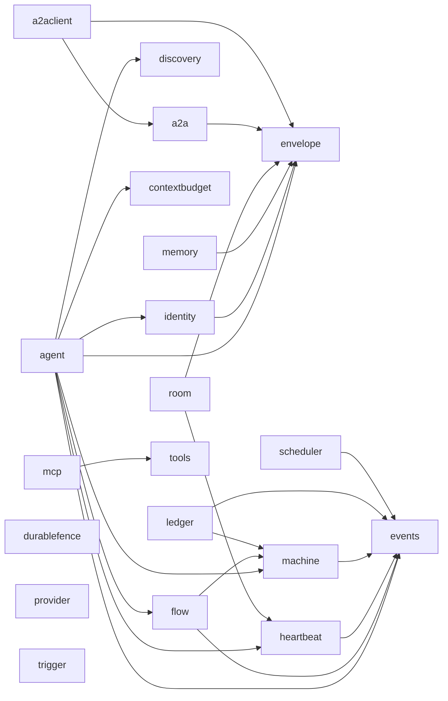
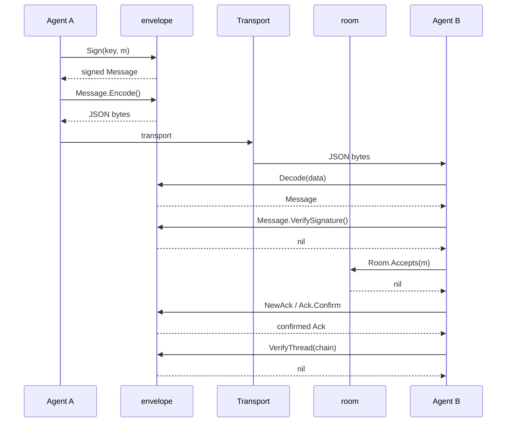

# Architecture

This document maps the modules, the message flow, the gate system, and
the invariants the architecture enforces. See
[protocol-design.md](protocol-design.md) for the wire rationale. See
[packages/envelope.md](packages/envelope.md),
[packages/room.md](packages/room.md),
[packages/machine.md](packages/machine.md),
[packages/flow.md](packages/flow.md),
[packages/identity.md](packages/identity.md),
[packages/events.md](packages/events.md),
[packages/a2a.md](packages/a2a.md),
[packages/a2aclient.md](packages/a2aclient.md),
[packages/ledger.md](packages/ledger.md),
[packages/memory.md](packages/memory.md), and
[packages/provider.md](packages/provider.md) for the exported API
references.

## Package map

The diagram shows the twenty-one packages and the import edges between
them. An arrow points from an importer to the package it imports.
`contextbudget`, `discovery`, `durablefence`, `envelope`, `events`,
`provider`, `tools`, and `trigger` are leaves: they import no other
package in this module.

- `envelope/` — the wire unit. It holds Message, Ack, Sign, and
  VerifyThread. One package per concern. See
  [packages/envelope.md](packages/envelope.md).
- `room/` — standing groups. It holds the roster, the roles, and
  message admission. It also provides `StaleMembers` and the sentinel
  `ErrNoMonitor`. `StaleMembers` takes a caller-supplied
  `*heartbeat.Monitor` and reports which current roster members
  `hb.Dead` also reports; the roster, not the `Monitor`, is the source
  of truth for membership. `room` imports `heartbeat`. See
  [packages/room.md](packages/room.md).
- `machine/` — the status model. It provides `Status`, `Trigger`,
  `Guard`, `Action`, `Transition`, `InOut`, `Definition`, `New`,
  `Initial`, `Transitions`, `AllowedTransitions`, `AllowedTriggers`,
  `Validate`, `Fire`, and the JSON wire form: `Encode`, `Decode`,
  `Registry`, `NewRegistry`, and `MoveEvent`. See
  [packages/machine.md](packages/machine.md).
- `flow/` — the step graph, the sequential runner, and the parallel
  panel waves. It provides `Step`, `Panel`, `Definition`, `New`,
  `Roots`, `Run`, `Confirm`, `Admission`, `Route`, `Outcome`, `Report`,
  `Failure`, `FailureFrom`, `Checkpoint`, `Resume`, `RetryPolicy`,
  `LoopPolicy`, `LoopState`, and `LoopStateFrom`. `Step` carries an
  optional `Sub *Definition` for chaining, an `Admission` rule in
  `When`, an optional `Route` that makes it a branch step, an optional
  `Retry *RetryPolicy` that bounds and paces repeated attempts of its
  own `Fire` call, and an optional `Loop *LoopPolicy` that repeats its
  `Sub` child workflow, gated by `LoopPolicy.Guard`, before its own
  transition and `Confirm` fire; `LoopPolicy.Max` caps the iteration
  count, and zero means unbounded, bounded only by the caller's own
  `ctx`. `Run` injects a `LoopState` into `ctx` before each `Guard`
  call, readable through `LoopStateFrom`; `New` rejects a `Loop`
  combined with a nil `Sub` or panel membership. `Run` walks the
  graph in topological order. A step named in no panel runs alone and
  gates on a confirmed ack. A step named in a panel runs as part of
  that panel's wave, in a goroutine, once every member is ready; the
  wave joins its members' errors with `errors.Join`. Once every one of
  a step's needs is terminal, its `Admission` rule decides whether it
  runs or skips; a branch step's `Route` then picks which of its
  direct dependents the run keeps, and the rest skip at once. A step
  with a non-nil `Retry` retries its `Fire` call, with exponential
  backoff computed by `RetryPolicy.NextDelay`, until it succeeds or
  exhausts `MaxAttempts`; `New` rejects a `Retry` combined with `Sub`
  or panel membership. A step admitted through a need that ended
  `OutcomeFailed` (`AdmissionOnFailed`) is a fallback: it catches a
  dependency's `Fire` failure, including one that exhausted its
  retries, or a `Route` failure, and lets the run continue instead of
  aborting, reading the failed step's `Failure` through `FailureFrom`.
  A `Confirm` rejection and a missing transition row stay fatal, and
  neither retries. `Run` returns a `Report` holding the final status,
  the final record, and every resolved step's `Outcome`:
  `OutcomeSucceeded`, `OutcomeFailed`, or `OutcomeSkipped`. `Run`'s
  `onCheckpoint` hook fires a `Checkpoint` after each step or wave
  succeeds; a caller pauses a run by canceling `ctx` and resumes it
  later from the last checkpoint through `Resume`. `Checkpoint`'s
  `Failed` field preserves an already-caught failure's outcome across
  the pause, but a still-pending fallback's handler bookkeeping does
  not survive the round trip. See [packages/flow.md](packages/flow.md).
- `events/` — the in-process reaction bus. It provides `Name`,
  `Event`, `Handler`, `Bus`, `New`, `Subscribe`, and `Emit`. The
  caller owns the bus; the module has no shared bus. Event names are
  typed `Name` constants owned by each domain. See
  [packages/events.md](packages/events.md).
- `identity/` — one agent key. It provides `Identity`, `New`, `Load`,
  `Validate`, `Sign`, `Signer`, and the sentinels `ErrKeyFormat` and
  `ErrKeyInvalid`. `Sign` wraps `envelope.Sign`; `Signer` derives the
  hex public key from the private key. See
  [packages/identity.md](packages/identity.md).
- `discovery/` — the capability card. It provides `Card`, `Parse`,
  `Validate`, and `Match`. `Parse` reads a card from JSON and validates
  it. `Validate` rejects a blank name, an empty capability list, and a
  duplicate capability. `Match` compares a capability request against
  the card, case-insensitive and exact. See
  [packages/discovery.md](packages/discovery.md).
- `agent/` — the composition layer. It provides `Agent`, `New`,
  `Name`, and `Capabilities`. `New` wires an `identity.Identity`, a
  `discovery.Card`, and a `flow.Definition` into one agent. It rejects
  a nil identity, an invalid card, and a nil plan, in that order. It
  also provides the envelope-to-events translator:
  `EmitMessageDelivered`, `EmitMessageAcked`, and `EmitThreadVerified`.
  Each function verifies an already-received `envelope.Message`,
  `envelope.Ack`, or message thread, then emits one typed
  `events.Event` onto a caller-owned `events.Bus`. It also provides
  `Run` and the `AckWait` function type: `Run` drives the agent's
  bound `flow.Definition` through `flow.Run`, in-process. For each
  step `flow.Run` gates behind `Confirm`, `Run` signs an
  `envelope.Message`, emits `MessageDeliveredEvent`, calls the
  caller-supplied `AckWait`, and emits `MessageAckedEvent` once the
  ack confirms. An `AckWait` that wraps `ErrEscalated` routes the step
  back to the caller. `Run` takes one trailing, optional
  `*heartbeat.Monitor` parameter. A non-nil `Monitor` beats one id,
  `a.id.Signer()+":"+threadID`, right before each gated step's
  `AckWait` call, and forgets it once, on every return path. A panel
  step reaches no beat call. `Run` never reads `Dead` itself; an
  external caller holding the same `Monitor` polls `Dead` on its own
  schedule. `Run` also takes one trailing, optional `room string`
  parameter. A non-empty `room` makes `Run` stamp it onto
  `Message.Room` before it signs each gated step's message; an empty
  `room` leaves `Message.Room` at the zero value. `Run` also takes one
  trailing, optional `*contextbudget.Limits` parameter. A non-nil
  `budget` runs `budget.Validate()` once, at the same point `Run`
  checks `wait`, `bus`, and `threadID`; an invalid budget returns its
  wrapped `Validate` error. A non-nil, valid `budget` makes
  `confirmStep` check `budget.Fits`, right before each gated step's
  `AckWait` call and before the heartbeat beat, against the cumulative
  byte total of every message built so far plus the step about to run.
  A `Fits` failure returns `ErrOverBudget`, wrapping the step ID,
  without beating, waiting, or emitting `MessageAckedEvent` for that
  step. A panel step reaches no `Fits` check either. `agent` imports
  `envelope`, `events`, `machine`, `heartbeat`, and `contextbudget`;
  none of those five packages imports `agent` or any of the other
  four. See [packages/agent.md](packages/agent.md).
- `heartbeat/` — a leaf primitive. It provides `Monitor`, `New`,
  `Beat`, `Alive`, `Dead`, `Forget`, and the typed event name
  `MissedEvent`. `Monitor` tracks liveness by time: it records the
  last beat per id and reports which ids have gone silent past a
  fixed timeout. `agent` and `room` both import it: `agent.Run`'s
  optional step-liveness heartbeat, and `room.Room.StaleMembers`'s
  roster-staleness check. It imports `events` only, for the
  `MissedEvent` constant. See
  [packages/heartbeat.md](packages/heartbeat.md).
- `a2a/` — the A2A v1.0 mapping. It provides `Part`, `Mapped`,
  `ToPart`, and `FromPart`. `ToPart` validates an `envelope.Message`
  and encodes it into a `Part`. `FromPart` decodes a `Part` back into
  a `Message`, with the caller-supplied `ContextID`/`MessageID`
  overriding any value embedded in the part. `a2a` imports `envelope`
  only; it carries no network call. See [packages/a2a.md](packages/a2a.md).
- `a2aclient/` — the a2a-go client adapter. It provides `Client`,
  `New`, `Close`, `TaskHandle`, `State`, and `Send`, `Status`, and
  `Result`. `Send` maps a signed message through `a2a.ToPart` and
  sends it as a remote task; `Status` polls the task's state; `Result`
  maps the output back through `a2a.FromPart` and re-verifies the
  signature. `a2aclient` imports `a2a` and `envelope`. It is the only
  package in this module allowed to import the third-party
  `github.com/a2aproject/a2a-go` and `google.golang.org/grpc`, the
  dial dependency `a2a-go`'s gRPC transport needs; this is the
  module's first external network call.
  See [packages/a2aclient.md](packages/a2aclient.md).
- `tools/` — the tool registry. It provides `Tool`, `Registry`,
  `InOut`, `Out`, `New`, `Add`, `Get`, `Remove`, and `Run`. A `Tool` is
  a named action; a `Registry` resolves one by name and runs it. `Add`
  and `Remove` mirror `room.Room`'s membership symmetry. It also
  provides `ExecutionClass`, `ExecutionProfile`, `ProfiledTool`,
  `ResultBudgetTool`, `PrivilegedTool`, `Scope`, `ScopeOptions`,
  `NewScope`, and `RunScoped`: optional execution-risk markers a
  `Tool` may implement, and a `Scope` that narrows which tools a run
  may invoke. `ScopeOptions.Approve` and `ScopeOptions.ApprovalThreshold`
  add a synchronous approval gate: `RunScoped` calls `Approve` with a
  `ToolCall` after `Allowed` passes and before it runs the tool,
  returning `ErrToolDeclined` for a decline. `tools` imports no other
  package in this module; `mcp` imports `tools`, and the agent binding
  is a later phase. See [packages/tools.md](packages/tools.md).
- `ledger/` — the durable-task-admission primitive. It provides
  `Ledger`, `New`, `Admit`, `Claim`, `Renew`, `Release`, `Takeover`,
  `Complete`, `State`, `Blocked`, `Snapshot`, `Encode`, `Decode`,
  `Restore`, the `Store` interface, and `MemStore`. `Admit` dedupes a
  task by `IdempotencyKey` and a sequence watermark. `Claim` and
  `Takeover` read `LeaseUntil` against a caller-supplied `now` as the
  only staleness signal; a `FenceToken` bumped on every claim fences a
  dispossessed owner's late write. `Complete` on a failed status walks
  the `Needs` graph and marks every transitive dependent
  `StatusBlocked`. `ledger` reuses `machine.Status` for its five task
  states and imports `events` for its typed event names; it imports
  no other package. See [packages/ledger.md](packages/ledger.md).
- `durablefence/` — a test-only conformance kit. It provides
  `Scenario`, `Validate`, `ErrIncompleteScenario`, seven `Check*`
  functions, and `RunAll`. A caller wires its own claim, takeover,
  mutate, release, and fence-reading calls into a `Scenario` literal
  and runs `RunAll` to prove the claim-and-fence invariants hold,
  including a concurrent takeover-versus-mutate race a sequential test
  cannot reach. `durablefence` is a leaf with no import edge to or
  from any other package in this module; no production code may import
  it. `ledger/ledger_test/scenario_test.go` wires it against `Ledger`.
- `memory/` — the content-addressed context store. It provides
  `Store`, `New`, `Put`, `Get`, and the sentinels `ErrNoBudget`,
  `ErrBudgetExceeded`, and `ErrUnknownRef`. `Put` computes a blob's
  ref with `envelope.ContextRef` and stores it under a fixed byte
  budget; a blob that would exceed the budget evicts the
  oldest-inserted blobs, in insertion order, until it fits. `memory`
  imports `envelope` only, for `ContextRef`. See
  [packages/memory.md](packages/memory.md).
- `mcp/` — the MCP tool-calling client. It provides `Transport`,
  `NewStdioTransport`, `NewStreamableHTTPTransport`, `ClientInfo`,
  `ProgressHandler`, `ClientOptions`, `Client`, `Connect`, `Close`,
  `ListTools`, `CallTool`, `CallToolWithProgress`, `SchemaTool`,
  `ContentBlock`, `CallResult`, `RegisterAll`, and `ErrClosed`.
  `Connect` opens a session over a local subprocess or a remote
  streamable HTTP endpoint, through the official MCP Go SDK's own
  client; `ListTools` and `CallTool` map the server's tools and
  results onto `tools.Tool` and `tools.Out`. `mcp` imports `tools`
  internally. It is the second package, after `a2aclient`, allowed to
  carry a third-party import: `github.com/modelcontextprotocol/go-sdk`,
  the official MCP Go SDK. See [packages/mcp.md](packages/mcp.md).
- `contextbudget/` — a leaf primitive. It provides `Limits`,
  `Validate`, and `Fits`. `Limits` caps one model call's context by
  byte count and event count; a zero field means no cap for that
  dimension. `Validate` rejects a negative `MaxBytes` or `MaxEvents`.
  `Fits` reports whether a candidate byte and event total both stay
  at or under their caps; it keeps no running total of its own.
  `contextbudget` imports no other package in this module; `agent`
  imports it for `Run`'s optional budget check.
- `provider/` — the model provider interface. It provides `Completer`,
  `RunTurn`, `Role` and its constants, `Message`, `Message.Validate`,
  `ToolDefinition`, `ToolCall`, `Usage`, `Request`, `Response`,
  `Chunk`, `Chunk.Validate`, `ContextAccountant`, `ReasoningPolicy`,
  and the sentinels `ErrToolCallIDUnexpected`, `ErrToolCallIDRequired`,
  `ErrUnknownRole`, `ErrChunkErrDoneConflict`, and
  `ErrStreamClosedEarly`. `Completer` has no
  implementation in this SDK; a caller supplies its own concrete type.
  `RunTurn` dispatches on `Request.Stream`, validates every message
  first, and aggregates a streamed `Chunk` sequence into one
  `Response`. `provider` imports no other package in this module. See
  [packages/provider.md](packages/provider.md).
- `channel/` — a leaf primitive. It provides `Question`,
  `Question.Validate`, `Answer`, `Answer.Validate`, `Notifier`, and
  the sentinels `ErrEmptyID`, `ErrEmptyRecipient`, `ErrEmptyPayload`,
  and `ErrEmptyQuestionID`. `Notifier` is a caller-implemented func
  type that asks a question and returns a typed `Answer`; `channel`
  ships no concrete transport. `channel` imports no other package in
  this module. See [packages/channel.md](packages/channel.md).
- `trigger/` — a leaf primitive. It provides `Condition`, `Action`,
  `Registry`, `New`, `Add`, `Remove`, `Fire`, and the sentinels
  `ErrBlankName`, `ErrNilAction`, `ErrDuplicateName`, `ErrUnknownName`,
  and `ErrConditionNotMet`. A `Registry` maps a name to one `Condition`
  and one `Action`; `Fire` evaluates the named `Condition` and, when
  true, calls the `Action`. `Condition` matches `machine.Guard`'s
  signature; `Action` is shaped to match `scheduler.Job`'s signature.
  `trigger` imports no other package in this module. See
  [packages/trigger.md](packages/trigger.md).
- `scheduler/` — the invoke-on-schedule primitive. It provides `Job`,
  `Schedule`, `Every`, `At`, `Scheduler`, `New`, `Add`, `Remove`,
  `Run`, `JobFailedEvent`, and the sentinels `ErrBlankID`,
  `ErrNilSchedule`, `ErrNilJob`, and `ErrDuplicateID`. `Run` fires each
  due `Job` in its own goroutine on a wake-channel sleep loop and
  emits `JobFailedEvent` on a caller-supplied `*events.Bus` when a
  `Job` fails. `scheduler` imports `events`. See
  [packages/scheduler.md](packages/scheduler.md).

The machine and flow packages compose. Flow imports machine for each
step's status transitions and for `Run`'s status walk. The machine
package imports events for its typed `MoveEvent` constant.
The events package imports nothing; it is a leaf.
The identity package imports envelope only; it wraps `envelope.Sign`.
The a2a package imports envelope only; it holds no other edge.
The a2aclient package imports a2a and envelope. It also imports the
third-party github.com/a2aproject/a2a-go, the one exception to this
module's standard-library-only rule; see AGENTS.md's Rules section.

The root holds no Go code. New concerns get new subpackages. The
import policy in `policy/layers.json` states which package may import
which; `scripts/check_deps.py` enforces it.

## Message flow

The wire form is the JSON bytes that Encode and Decode handle.

1. **Sign.** `envelope/sign.go`, `Sign(key, m)`: sets Signer and
   Signature. The signature covers the canonical JSON of every field
   except itself.
2. **Encode.** `envelope/message.go`, `Message.Encode`: validates, then
   marshals to JSON. An invalid message cannot cross the wire.
3. **Transport.** Out of scope for this SDK. The wire form is the JSON
   bytes from Encode and to Decode.
4. **Decode.** `envelope/message.go`, `Decode(data)`: parses JSON, then
   validates. Unknown fields are ignored for forward compatibility.
5. **Verify.** `envelope/sign.go`, `Message.VerifySignature`: checks
   the ed25519 signature against the embedded Signer key.
6. **Room admission.** `room/room.go`, `Room.Accepts`: checks the room
   name, the signature, and the membership of the signer and the
   recipients.
7. **Ack.** `envelope/ack.go`, `NewAck`, `Ack.Confirm`, `Ack.Correct`:
   the semantic-ack flow. Only a confirmed Ack means the receiver may
   act.
8. **Thread chain.** `envelope/thread.go`, `VerifyThread`: checks the
   hash chain and rejects repeated message IDs.

## Gate system

The gates are mechanical. They run in `make verify` and, on a subset,
in the pre-commit hook.

- `scripts/` — the gates: check_docs, check_structure, check_deps,
  check_plan, check_prose, check_api, check_gomod,
  check_semgrepignore, check_labels, check_names,
  check_semgrep_probes, and api_surface (Go).
- `semgrep/` — the pattern rules: no panic or exit in packages,
  stdlib-only imports, centralized constants, no hardcoded secrets, no
  suppression markers, no drift markers.
- `.githooks/pre-commit` — runs `make verify-fast` on the staged
  snapshot. The worktree never leaks into the commit.

`make verify-fast` runs gofmt, vet, one test pass, the python gates,
the semgrep scan, and the suppression-marker scan. `make verify` runs
everything verify-fast runs, plus the coverage floor and the semgrep
probe suite.

## Invariants

The architecture enforces these rules:

- No root Go code. The root holds go.mod, the Makefile, and docs.
- One package per concern. New concerns get new subpackages.
- The import policy. `policy/layers.json` lists the allowed internal
  edges; `scripts/check_deps.py` enforces them.
- The API locks. The files in `api/` pin the exported surface;
  `scripts/check_api.py` diffs them.
- The plans gate. Every top-level package needs a plan;
  `scripts/check_plan.py` enforces it.
- The writing standard. Sentences stay at or below 25 words;
  `scripts/check_prose.py` scans the whole docs tree.
- The label ban. Audit-finding labels never appear in comments, docs,
  or plans; `scripts/check_labels.py` scans every file.
- The drift-marker ban and the suppression ban. The semgrep rules and
  the suppression-marker scan enforce them.
- The coverage floor. The total and every package reach 85; the
  coverage block in `make verify` enforces it.
