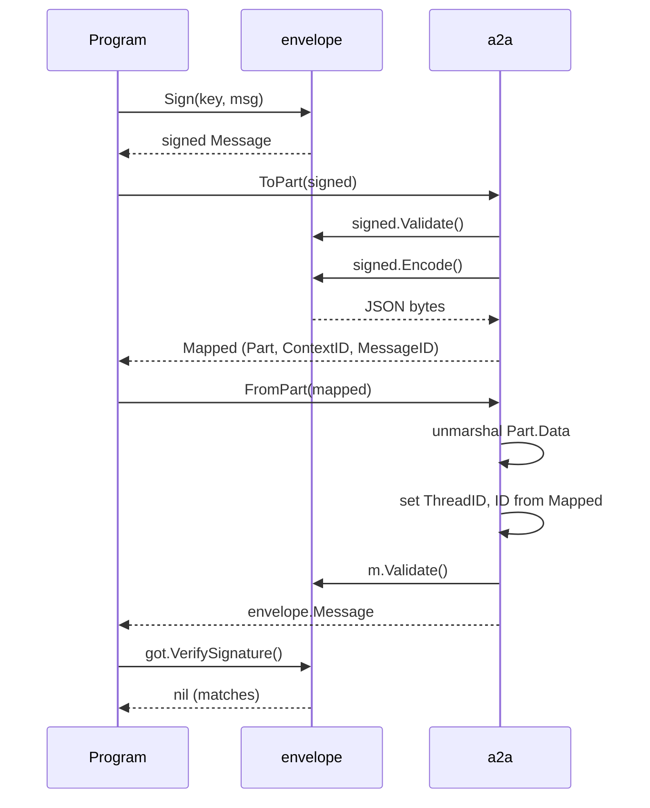

# Example: an A2A mapping round trip

This walkthrough follows one signed message across an A2A boundary:
sign, map to a `Part`, map back, then verify. The program builds and
runs against the module.

## The sign-map-unmap-verify sequence



## The program

```go
package main

import (
	"crypto/ed25519"
	"fmt"
	"reflect"

	"github.com/MiviaLabs/mivia-ai-sdk/a2a"
	"github.com/MiviaLabs/mivia-ai-sdk/envelope"
)

func main() {
	_, key, _ := ed25519.GenerateKey(nil)

	msg := envelope.Message{
		Version:    envelope.Version,
		ID:         "msg-1",
		ThreadID:   "task-42",
		Intent:     envelope.IntentAssert,
		Epistemic:  envelope.EpistemicInferred,
		Confidence: 0.9,
		Provenance: envelope.Provenance{Source: "model:self"},
		Payload:    "The build is green.",
	}

	// Sign sets the signer and the signature.
	signed, err := envelope.Sign(key, msg)
	if err != nil {
		fmt.Println("sign:", err)
	}

	// ToPart validates, then encodes the message into Part.Data.
	mapped, err := a2a.ToPart(signed)
	if err != nil {
		fmt.Println("to part:", err)
	}
	fmt.Println("context id:", mapped.ContextID)
	fmt.Println("message id:", mapped.MessageID)
	fmt.Println("part data:", string(mapped.Part.Data))

	// FromPart decodes Part.Data, then reapplies ContextID and MessageID.
	got, err := a2a.FromPart(mapped)
	if err != nil {
		fmt.Println("from part:", err)
	}

	// The round-tripped message still verifies.
	if err := got.VerifySignature(); err != nil {
		fmt.Println("verify:", err)
	} else {
		fmt.Println("verify: ok")
	}

	// The round trip preserves every field.
	if reflect.DeepEqual(signed, got) {
		fmt.Println("fields identical: true")
	} else {
		fmt.Println("fields identical: false")
	}
}
```

Output:

```
context id: task-42
message id: msg-1
part data: {"version":"v1","id":"msg-1","thread_id":"task-42","intent":"assert","epistemic":"inferred","confidence":0.9,"provenance":{"source":"model:self"},"payload":"The build is green.","signer":"<hex ed25519 public key>","signature":"<hex ed25519 signature>"}
verify: ok
fields identical: true
```

`signer` and `signature` come out different on every run: `ed25519.GenerateKey(nil)` draws a fresh key from `crypto/rand` each time. Every other field, and the `verify: ok`/`fields identical: true` lines, stay exactly as shown.

## What the program shows

`ToPart` validates the signed message, then reuses `Message.Encode` to
fill `Part.Data`. It carries `ThreadID` and `ID` separately, on
`Mapped`, because A2A v1.0 keeps those two fields on the wrapping
message, not on a `Part`. `FromPart` unmarshals `Part.Data`, then
overwrites `ThreadID` with `ContextID` and `ID` with `MessageID`
before it validates. Here both overwrites restore the same values the
message already carried, so the round trip changes nothing. The
signature survives inside `Part.Data` untouched, so `VerifySignature`
still succeeds on the far side. `reflect.DeepEqual` confirms every
field, not only the signature, comes back identical.
