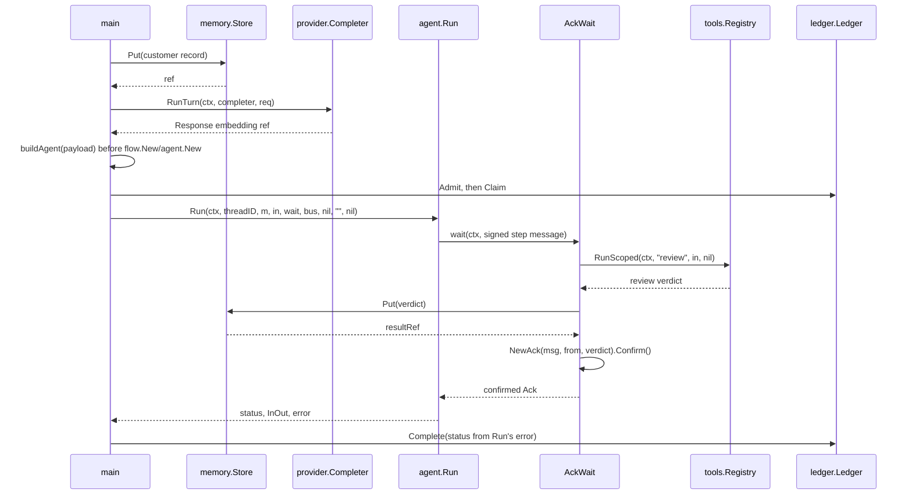

# Example: composing agent.Run with provider, tools, ledger, and memory

This walkthrough composes `agent.Run` with five packages that `agent`
itself never imports: `provider`, `tools`, `mcp`, `ledger`, and
`memory`. Each composes through a seam `Run` already exposes, not
through a new import: plan-construction time, before `flow.New` and
`agent.New` run, or the caller-supplied `AckWait` closure `Run` calls
once per gated step. See
[packages/agent.md](../packages/agent.md#composing-with-provider-tools-mcp-ledger-and-memory)
for the seam-by-seam reasoning.

A `memory.Store` holds a customer record before the plan is built. A
canned `provider.Completer`, driven through `provider.RunTurn`, drafts
a step's payload that embeds the record's `memory.Store` ref. A
`tools.Registry` holds one review tool the `AckWait` closure calls
through `RunScoped`. A `ledger.Ledger` admits and claims the task
before `Run` starts, and completes it after `Run` returns, with the
completed status set from `Run`'s own returned error.

## The program

```go
package main

import (
	"context"
	"fmt"
	"time"

	"github.com/MiviaLabs/mivia-ai-sdk/agent"
	"github.com/MiviaLabs/mivia-ai-sdk/discovery"
	"github.com/MiviaLabs/mivia-ai-sdk/envelope"
	"github.com/MiviaLabs/mivia-ai-sdk/events"
	"github.com/MiviaLabs/mivia-ai-sdk/flow"
	"github.com/MiviaLabs/mivia-ai-sdk/identity"
	"github.com/MiviaLabs/mivia-ai-sdk/ledger"
	"github.com/MiviaLabs/mivia-ai-sdk/machine"
	"github.com/MiviaLabs/mivia-ai-sdk/memory"
	"github.com/MiviaLabs/mivia-ai-sdk/provider"
	"github.com/MiviaLabs/mivia-ai-sdk/tools"
)

// ledger identifiers fixed for this demo's single task.
const (
	ledgerActor = ledger.Actor("composer")
	ledgerOwner = ledger.OwnerID("worker-1")
	ledgerKey   = ledger.IdempotencyKey("task-composition-1")
	ledgerLease = time.Minute
)

// cannedCompleter is a package-local provider.Completer test double
// standing in for a model that read retrieved context and drafted a
// step's text.
type cannedCompleter struct {
	reply string
}

// Name returns the completer's model name.
func (c cannedCompleter) Name() string { return "canned-completer" }

// Chat returns a fixed Response embedding c.reply.
func (c cannedCompleter) Chat(ctx context.Context, req provider.Request) (provider.Response, error) {
	return provider.Response{
		Model:   c.Name(),
		Message: provider.Message{Role: provider.RoleAssistant, Content: c.reply},
	}, nil
}

// ChatStream is unused by this demo; it satisfies provider.Completer.
func (c cannedCompleter) ChatStream(ctx context.Context, req provider.Request) (<-chan provider.Chunk, error) {
	ch := make(chan provider.Chunk)
	close(ch)
	return ch, nil
}

// reviewTool is a locally defined tools.Tool standing in for a review
// step a registry-backed workflow would call.
type reviewTool struct{}

// Name returns the tool's registry name.
func (reviewTool) Name() string { return "review" }

// Run returns a fixed review verdict over the given payload.
func (reviewTool) Run(ctx context.Context, in tools.InOut) (tools.Out, error) {
	payload, _ := in.Value.(string)
	return tools.Out{Value: "reviewed: " + payload}, nil
}

// generatePayload puts a customer record into store, then drives a
// canned provider.Completer through provider.RunTurn to draft a
// step's payload embedding the record's memory.Store ref.
func generatePayload(ctx context.Context, store *memory.Store) (string, error) {
	ref, err := store.Put([]byte("customer 42 asked about invoice status"))
	if err != nil {
		return "", err
	}

	completer := cannedCompleter{reply: "review invoice for context " + ref}
	resp, err := provider.RunTurn(ctx, completer, provider.Request{
		Model:    completer.Name(),
		Messages: []provider.Message{{Role: provider.RoleUser, Content: "draft a review step"}},
	})
	if err != nil {
		return "", err
	}
	return resp.Message.Content, nil
}

// buildAgent builds a one-step plan carrying payload, then binds it
// into an *agent.Agent under a freshly generated identity. It also
// returns a second identity, the one the AckWait closure signs the
// confirmed Ack with.
func buildAgent(payload string) (*agent.Agent, *identity.Identity, error) {
	id, err := identity.New()
	if err != nil {
		return nil, nil, err
	}
	receiver, err := identity.New()
	if err != nil {
		return nil, nil, err
	}

	card := discovery.Card{
		Name:         "composition-agent",
		Capabilities: []string{"invoice.review"},
	}
	plan, err := flow.New([]flow.Step{
		{ID: "review", To: "reviewed", Payload: payload},
	}, nil)
	if err != nil {
		return nil, nil, err
	}

	a, err := agent.New(id, card, plan)
	if err != nil {
		return nil, nil, err
	}
	return a, receiver, nil
}

// buildRegistry builds a tools.Registry holding one locally defined
// review tool. An MCP server's tools would join the same Registry
// through mcp.RegisterAll, before Run starts; see the package doc for
// that seam.
func buildRegistry() *tools.Registry {
	reg := tools.New()
	_ = reg.Add(reviewTool{})
	return reg
}

// admitAndClaim admits and claims the demo's one task against led,
// returning the fence token Complete later needs.
func admitAndClaim(led *ledger.Ledger, key ledger.IdempotencyKey, now time.Time) (ledger.FenceToken, error) {
	if _, err := led.Admit(context.Background(), ledgerActor, key, 1, "review invoice 42", now); err != nil {
		return 0, err
	}
	return led.Claim(context.Background(), ledgerActor, key, ledgerOwner, ledgerLease, now)
}

// subscribeAll subscribes a no-op handler to every event Run emits;
// events.Bus.Emit fails a name with no subscriber.
func subscribeAll(bus *events.Bus) error {
	noop := func(context.Context, events.Event) error { return nil }
	for _, name := range []events.Name{agent.MessageDeliveredEvent, agent.MessageAckedEvent, agent.ThreadVerifiedEvent} {
		if err := bus.Subscribe(name, noop); err != nil {
			return err
		}
	}
	return nil
}

// buildWait returns the agent.AckWait closure that runs the review
// tool against the signed step's payload, stores the tool's result in
// store under a second Put, records that ref into resultRef, and
// confirms the ack.
func buildWait(reg *tools.Registry, store *memory.Store, id *identity.Identity, resultRef *string) agent.AckWait {
	return func(ctx context.Context, msg envelope.Message) (envelope.Ack, error) {
		out, err := reg.RunScoped(ctx, "review", tools.InOut{Value: msg.Payload}, nil)
		if err != nil {
			return envelope.Ack{}, err
		}
		verdict, _ := out.Value.(string)

		ref, err := store.Put([]byte(verdict))
		if err != nil {
			return envelope.Ack{}, err
		}
		*resultRef = ref

		ack, err := envelope.NewAck(msg, id.Signer(), verdict)
		if err != nil {
			return envelope.Ack{}, err
		}
		return ack.Confirm(), nil
	}
}

// runMachine drives a.Run over a one-transition machine and returns
// the final machine.Status and Run's own error unchanged.
func runMachine(ctx context.Context, a *agent.Agent, wait agent.AckWait, bus *events.Bus) (machine.Status, error) {
	m, err := machine.New("queued",
		machine.Transition{From: "queued", To: "reviewed", Trigger: "send"},
	)
	if err != nil {
		return "", err
	}
	status, _, err := a.Run(ctx, "thread-composition-1", m, machine.InOut{Input: "review invoice 42"}, wait, bus, nil, "", nil)
	return status, err
}

func main() {
	ctx := context.Background()
	now := time.Now()

	store, err := memory.New(4096)
	if err != nil {
		fmt.Println("memory.New:", err)
		return
	}

	payload, err := generatePayload(ctx, store)
	if err != nil {
		fmt.Println("generatePayload:", err)
		return
	}

	a, receiver, err := buildAgent(payload)
	if err != nil {
		fmt.Println("buildAgent:", err)
		return
	}

	reg := buildRegistry()

	bus := events.New()
	if err := subscribeAll(bus); err != nil {
		fmt.Println("subscribeAll:", err)
		return
	}

	led, err := ledger.New(ledger.NewMemStore(), bus)
	if err != nil {
		fmt.Println("ledger.New:", err)
		return
	}
	fence, err := admitAndClaim(led, ledgerKey, now)
	if err != nil {
		fmt.Println("admitAndClaim:", err)
		return
	}

	var resultRef string
	wait := buildWait(reg, store, receiver, &resultRef)

	status, runErr := runMachine(ctx, a, wait, bus)
	if runErr != nil {
		fmt.Println("run:", runErr)
		_ = led.Complete(ctx, ledgerActor, ledgerKey, ledgerOwner, fence, ledger.StatusFailed, time.Now())
		return
	}
	if err := led.Complete(ctx, ledgerActor, ledgerKey, ledgerOwner, fence, ledger.StatusCompleted, time.Now()); err != nil {
		fmt.Println("ledger.Complete:", err)
		return
	}

	state, _, err := led.State(ctx, ledgerKey)
	if err != nil {
		fmt.Println("ledger.State:", err)
		return
	}

	fmt.Println("final status:", status)
	fmt.Println("ledger status:", state.Status)
	fmt.Println("result ref:", resultRef)
}
```

## The call order



## What the program shows

`memory.New` builds a byte-budgeted store. `generatePayload` puts one
customer record before the plan exists, and `envelope.ContextRef`
hashes its content into the returned ref. A local `cannedCompleter`,
a `provider.Completer` test double, stands in for a model that reads
retrieved context; `provider.RunTurn` drives its `Chat` method and
returns a `Response` whose `Message.Content` embeds the ref. This
proves where a model-generated payload plugs into the plan: at
plan-construction time, before `flow.New` and `agent.New` run, because
`Run` fixes a step's `Payload` before it starts and has no way to feed
generated content back into an already-signed message.

`buildAgent` builds a one-step `flow.Definition` carrying that drafted
payload, then binds a fresh `identity.Identity` and a `discovery.Card`
into an `*agent.Agent`. It also returns a second identity, the one the
`AckWait` closure signs the confirmed `Ack` with, standing in for a
distinct receiver.

`buildRegistry` builds a `tools.Registry` holding one locally defined
review tool. An MCP server's tools would join the same `Registry`
through `mcp.RegisterAll`, called once before `Run` starts, against
the same `Registry` the `AckWait` closure already holds;
`mcp/client_test.go`'s own round-trip test already proves that
mapping, so this walkthrough does not stand up a transport to repeat
it.

`admitAndClaim` calls `ledger.Admit`, then `ledger.Claim`, against a
`ledger.Ledger` built over `ledger.NewMemStore()`, before `Run` starts.
This matches `ledger.md`'s own framing: a `flow.Run` invocation, or an
`agent.Run` invocation one level up, is the task body a `ledger` owner
claims and executes.

`subscribeAll` subscribes a no-op handler to `agent.MessageDeliveredEvent`,
`agent.MessageAckedEvent`, and `agent.ThreadVerifiedEvent` before `Run`
starts; `events.Bus.Emit` fails a name with no subscriber, so `Run`
would fail without this step.

`buildWait` returns the `AckWait` closure. It reads the signed step
message's `Payload`, calls `reg.RunScoped(ctx, "review",
tools.InOut{Value: payload}, nil)` with a nil `Scope` that bypasses
both `Allowed` and `approve`, puts the tool's verdict into the
`memory.Store` under a second ref, then builds a confirmed
`envelope.Ack` in two steps: `ack, err := envelope.NewAck(msg, from,
verdict)`, returning `err` when non-nil, then `return ack.Confirm(),
nil`. The verdict becomes the ack's `Restatement` field.

`runMachine` drives `agent.Run` with its existing nine positional
arguments, over a one-transition machine from `queued` to `reviewed`.
`main` checks `runMachine`'s returned error the same way
[agent-dispatch.md](agent-dispatch.md) checks every call: on a
non-nil error, it completes the ledger claim with `ledger.StatusFailed`
and returns before printing anything; on a nil error, it completes the
claim with `ledger.StatusCompleted`. This demo's fixed inputs never
take the failure branch, so a failed `Run` blocking the claim's
dependents through `ledger.Complete`'s `StatusFailed` handling stays a
described, not printed, path.

Running the program prints:

```text
final status: reviewed
ledger status: completed
result ref: sha256:7c7b2c396027bf0e8b601fb5559e02d7b232b1edc5854b4723d04b8927b7fc0b
```

## SQLiteStore variant

The same admit-claim-complete sequence composes unchanged over
`ledger.SQLiteStore`, behind the `ledger_sqlite` build tag. One line
changes: `ledger.New` takes `ledger.NewSQLiteStore(":memory:")` in
place of `ledger.NewMemStore()`.

```go
//go:build ledger_sqlite

package main

import (
	"context"
	"fmt"
	"time"

	"github.com/MiviaLabs/mivia-ai-sdk/ledger"
)

// ledger identifiers fixed for this demo's single task, matching the
// default-tag program in ../_agentcomposition/main.go.
const (
	ledgerActor = ledger.Actor("composer")
	ledgerOwner = ledger.OwnerID("worker-1")
	ledgerKey   = ledger.IdempotencyKey("task-composition-1")
	ledgerLease = time.Minute
)

func main() {
	ctx := context.Background()
	now := time.Now()

	store, err := ledger.NewSQLiteStore(":memory:")
	if err != nil {
		fmt.Println("ledger.NewSQLiteStore:", err)
		return
	}
	defer store.Close()

	led, err := ledger.New(store, nil)
	if err != nil {
		fmt.Println("ledger.New:", err)
		return
	}

	if _, err := led.Admit(ctx, ledgerActor, ledgerKey, 1, "review invoice 42", now); err != nil {
		fmt.Println("ledger.Admit:", err)
		return
	}
	fence, err := led.Claim(ctx, ledgerActor, ledgerKey, ledgerOwner, ledgerLease, now)
	if err != nil {
		fmt.Println("ledger.Claim:", err)
		return
	}
	if err := led.Complete(ctx, ledgerActor, ledgerKey, ledgerOwner, fence, ledger.StatusCompleted, time.Now()); err != nil {
		fmt.Println("ledger.Complete:", err)
		return
	}

	state, _, err := led.State(ctx, ledgerKey)
	if err != nil {
		fmt.Println("ledger.State:", err)
		return
	}

	fmt.Println("ledger status:", state.Status)
}
```

Run it with the build tag:

```sh
go run -tags ledger_sqlite ./docs/examples/_agentcompositionsqlite
```

It prints:

```text
ledger status: completed
```

A plain `go run ./docs/examples/_agentcompositionsqlite`, without the
tag, fails with "build constraints exclude all Go files": the default
build never compiles `SQLiteStore`.
