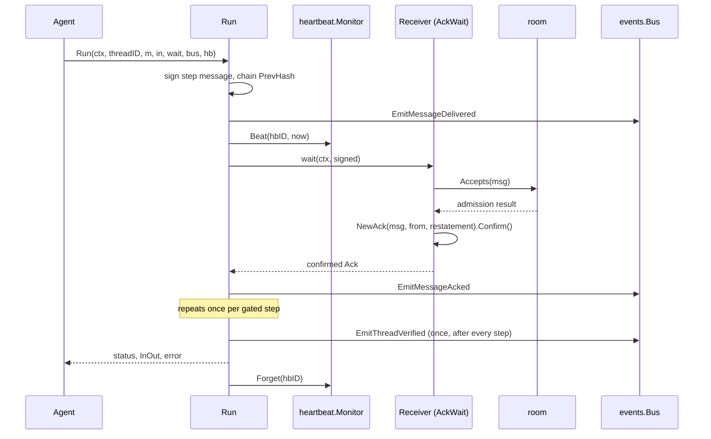

# Example: agent dispatch end to end

This walkthrough ties every building block together: an identity signs
a step message, a discovery card describes the agent's capability, a
flow plan drives a machine through one gated step, a room checks
admission, a heartbeat monitor tracks liveness, and an event bus
records the exchange. The program builds and runs against the module.

## The program

```go
package main

import (
	"context"
	"fmt"
	"sync"
	"time"

	"github.com/MiviaLabs/mivia-ai-sdk/agent"
	"github.com/MiviaLabs/mivia-ai-sdk/discovery"
	"github.com/MiviaLabs/mivia-ai-sdk/envelope"
	"github.com/MiviaLabs/mivia-ai-sdk/events"
	"github.com/MiviaLabs/mivia-ai-sdk/flow"
	"github.com/MiviaLabs/mivia-ai-sdk/heartbeat"
	"github.com/MiviaLabs/mivia-ai-sdk/identity"
	"github.com/MiviaLabs/mivia-ai-sdk/machine"
	"github.com/MiviaLabs/mivia-ai-sdk/room"
)

func main() {
	// The dispatching agent's own key pair.
	id, err := identity.New()
	if err != nil {
		fmt.Println("identity.New:", err)
		return
	}

	// The receiver's key pair; it founds the room and acks the message.
	receiver, err := identity.New()
	if err != nil {
		fmt.Println("identity.New receiver:", err)
		return
	}

	card := discovery.Card{
		Name:         "dispatch-agent",
		Capabilities: []string{"task.dispatch"},
	}

	plan, err := flow.New([]flow.Step{
		{ID: "dispatch", To: "dispatched", Payload: "handle the incoming request"},
	}, nil)
	if err != nil {
		fmt.Println("flow.New:", err)
		return
	}

	a, err := agent.New(id, card, plan)
	if err != nil {
		fmt.Println("agent.New:", err)
		return
	}

	// The receiver founds a room and admits the dispatching agent.
	rm, err := room.New("dispatch-room", receiver.Signer())
	if err != nil {
		fmt.Println("room.New:", err)
		return
	}
	if err := rm.Admit(id.Signer(), receiver.Signer()); err != nil {
		fmt.Println("room.Admit:", err)
		return
	}

	mon, err := heartbeat.New(30 * time.Second)
	if err != nil {
		fmt.Println("heartbeat.New:", err)
		return
	}

	bus := events.New()
	var mu sync.Mutex
	var seen []events.Name
	record := func(ctx context.Context, e events.Event) error {
		mu.Lock()
		defer mu.Unlock()
		seen = append(seen, e.Name)
		return nil
	}
	for _, name := range []events.Name{agent.MessageDeliveredEvent, agent.MessageAckedEvent, agent.ThreadVerifiedEvent} {
		if err := bus.Subscribe(name, record); err != nil {
			fmt.Println("subscribe:", err)
			return
		}
	}

	// wait plays the receiver's role: it checks room admission, then
	// builds and confirms a real Ack. agent.Run does not stamp Room
	// on the messages it builds, so this Accepts call reports the
	// mismatch; a production receiver would route through a room-aware
	// transport that sets Room before Run signs it.
	wait := func(ctx context.Context, msg envelope.Message) (envelope.Ack, error) {
		if err := rm.Accepts(msg); err != nil {
			fmt.Println("room check:", err)
		} else {
			fmt.Println("room check: accepted")
		}
		ack, err := envelope.NewAck(msg, receiver.Signer(), "received: "+msg.Payload)
		if err != nil {
			return envelope.Ack{}, err
		}
		return ack.Confirm(), nil
	}

	m, err := machine.New("queued",
		machine.Transition{From: "queued", To: "dispatched", Trigger: "send"},
	)
	if err != nil {
		fmt.Println("machine.New:", err)
		return
	}

	status, _, err := a.Run(context.Background(), "thread-dispatch-1", m, machine.InOut{Input: "incoming task"}, wait, bus, mon)
	if err != nil {
		fmt.Println("run:", err)
		return
	}

	fmt.Println("final status:", status)
	mu.Lock()
	fmt.Println("events:", seen)
	mu.Unlock()
}
```

## The call order



## What the program shows

`identity.New` generates the dispatching agent's ed25519 key pair.
`discovery.Card` names the agent and lists one capability,
`task.dispatch`; `agent.New` validates the card before it binds
identity, card, and plan into an `Agent`. The plan is one gated step
outside any panel, so `flow.Run` gates it behind `Confirm` and `Run`
gets a hook to build a signed message and wait for its ack.

`room.New` and `Admit` build a receiver-side roster with the
dispatching agent as a member. `Run` signs each step message with the
agent's identity but does not stamp `Message.Room`, so the room's
`Accepts` call inside `wait` reports a room mismatch; the printed line
reads `room check: message names a different room: ""`. This stands
in for the real gap a production receiver must close: a transport
layer that sets `Room` before the message reaches `Run`'s signing
step, so admission can gate on membership instead of failing on an
unset field. `wait` still builds and confirms a real `envelope.Ack`
through `envelope.NewAck` and `Confirm`, which stands in for a
receiver that accepts the message through its own channel and
acknowledges it back to the sender.

`heartbeat.New` builds a monitor with a thirty-second timeout. `Run`
beats one id, the agent's signer joined with the thread ID, right
before it calls `wait` for the gated step, and forgets that id on
every return path. This stands in for a supervisor that polls `Dead`
on its own schedule to notice a stalled step.

`events.New` builds the bus, and the program subscribes to
`agent.MessageDeliveredEvent`, `agent.MessageAckedEvent`, and
`agent.ThreadVerifiedEvent` before the run starts. The captured order
is `agent.message_delivered`, `agent.message_acked`, then
`agent.thread_verified`: one delivered-and-acked pair for the single
gated step, then one closing thread verification once `Run` finishes
with at least one gated step. This stands in for an observer, such as
a logging or metrics subscriber, that reacts to the exchange without
being wired into `Run` itself.

The final `machine.Status` is `dispatched`, the status the step's one
transition reaches from the machine's initial `queued` status.
