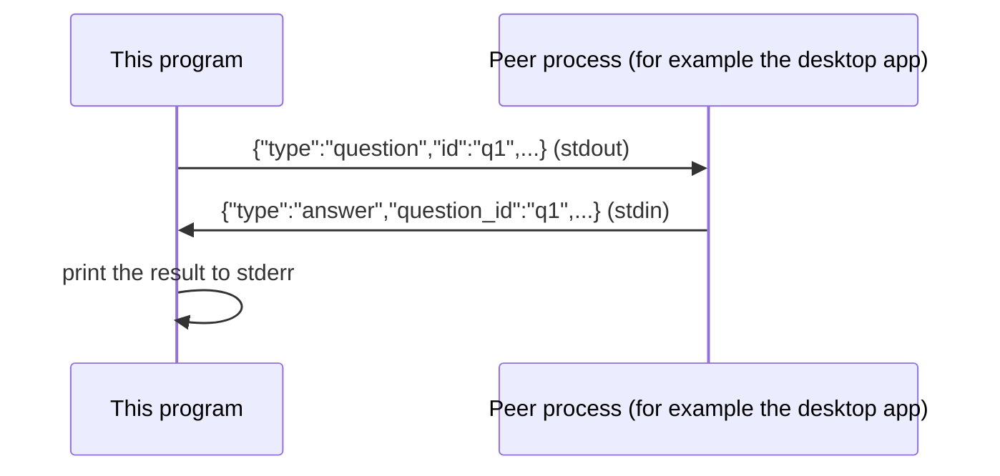

# Example: channel NDJSON over stdio

This walkthrough wires `channel.NewNDJSONNotifier` to `os.Stdin` and
`os.Stdout`, the same newline-delimited-JSON (NDJSON) convention
`mivia-agent`'s desktop app already uses for its own `--json` line
mode and its `internal/hub` process-to-process protocol. The program
writes one question line to stdout, blocks reading one answer line
from stdin, then prints the result to stderr, so a peer process
reading this program's stdout sees only the protocol line, not the
human-readable summary.

## The message flow



## The program

```go
package main

import (
	"context"
	"fmt"
	"os"

	"github.com/MiviaLabs/mivia-ai-sdk/channel"
)

func main() {
	notify := channel.NewNDJSONNotifier(os.Stdin, os.Stdout)

	q := channel.Question{
		ID:        "q1",
		Recipient: "desktop-app",
		Payload:   "deploy to production?",
	}
	if err := q.Validate(); err != nil {
		fmt.Fprintln(os.Stderr, "validate:", err)
		os.Exit(1)
	}

	// A peer process reads the question line this call writes to
	// os.Stdout, then writes a matching answer line to this
	// program's os.Stdin: for example
	// {"type":"answer","question_id":"q1","approved":true,"payload":"go ahead"}
	a, err := notify(context.Background(), q)
	if err != nil {
		fmt.Fprintln(os.Stderr, "notify:", err)
		os.Exit(1)
	}

	fmt.Fprintln(os.Stderr, "approved:", a.Approved, "payload:", a.Payload)
}
```

## What the program shows

`NewNDJSONNotifier(os.Stdin, os.Stdout)` returns a `channel.Notifier`
that writes `q` as one JSON line to stdout and blocks reading one JSON
line back from stdin. A peer process on the other end of these two
pipes (for example a desktop app spawning this program, or a shell
pipeline feeding it a canned answer) supplies the answer line. Given
the answer line in the comment above on stdin, the program prints
`approved: true payload: go ahead` to stderr. `ErrNotifierBusy` and
`ErrAnswerMismatch` cover the failure paths a real integration must
handle; see [packages/channel.md](../packages/channel.md)'s NDJSON
transport section for the full contract, including the
permanent-lockout limit after a canceled call and its close-`w`-or-`r`
recourse, whichever phase is pending.
