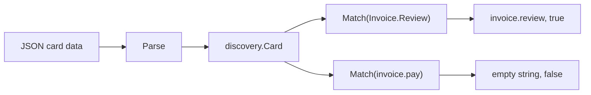

# Example: discovery capability match

This walkthrough parses one capability card and checks it against two
requested capabilities. `Parse` decodes the JSON and calls `Validate`
before returning the card. `Match` then compares a requested
capability against each entry with `strings.EqualFold`, so casing in
the request does not matter. One request matches an entry; the other
does not. The program builds and runs against the module.

## The match check



## The program

```go
package main

import (
	"fmt"

	"github.com/MiviaLabs/mivia-ai-sdk/discovery"
)

func main() {
	data := []byte(`{
		"name": "invoice-agent",
		"description": "Reviews and approves vendor invoices.",
		"capabilities": ["invoice.review", "invoice.approve"]
	}`)

	card, err := discovery.Parse(data)
	if err != nil {
		fmt.Println("parse:", err)
		return
	}

	// The requested capability matches an entry, case-insensitively.
	matched, ok := card.Match("Invoice.Review")
	fmt.Println("match invoice.review:", matched, ok)

	// The requested capability is not on the card.
	matched, ok = card.Match("invoice.pay")
	fmt.Println("match invoice.pay:", matched, ok)
}
```

## What the program shows

`Parse` decodes the JSON into a `Card` and calls `Validate`, which
checks the name and the capability list before `Parse` returns. The
card lists two capabilities: `invoice.review` and `invoice.approve`.
`Match("Invoice.Review")` compares the request against each entry
with `strings.EqualFold`, so the differing case still matches
`invoice.review`; `Match` returns the stored entry, not the request's
casing. `Match("invoice.pay")` compares against both entries and
finds neither equal, so it returns an empty string and false. The
program prints `match invoice.review: invoice.review true` and
`match invoice.pay:  false`.
