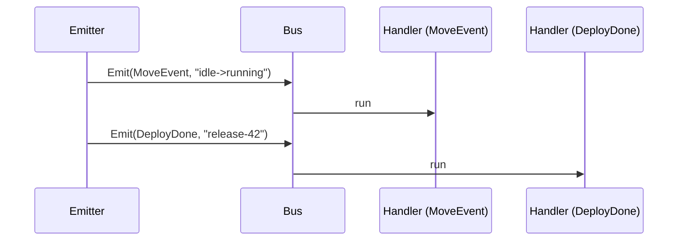

# Example: the events bus

This walkthrough shares one `events.Bus` between two subscribers: one
listens for the machine package's own `machine.MoveEvent`, and one
listens for a caller-defined `events.Name` constant. Both handlers
fire from their own `Emit` call. The bus is caller-owned; the module
holds no shared bus. The program builds and runs against the module.

## The dispatch sequence



## The program

```go
package main

import (
	"context"
	"fmt"

	"github.com/MiviaLabs/mivia-ai-sdk/events"
	"github.com/MiviaLabs/mivia-ai-sdk/machine"
)

// DeployDone is a caller-defined event name for a domain concern.
const DeployDone events.Name = "deploy.done"

func main() {
	bus := events.New()
	var moves []string
	var deploys []string

	// One subscriber listens for the machine package's own event name.
	if err := bus.Subscribe(machine.MoveEvent, func(_ context.Context, e events.Event) error {
		moves = append(moves, e.Data)
		return nil
	}); err != nil {
		fmt.Println("subscribe move:", err)
		return
	}

	// A second subscriber listens for a name this caller defines.
	if err := bus.Subscribe(DeployDone, func(_ context.Context, e events.Event) error {
		deploys = append(deploys, e.Data)
		return nil
	}); err != nil {
		fmt.Println("subscribe deploy:", err)
		return
	}

	ctx := context.Background()

	if err := bus.Emit(ctx, events.Event{Name: machine.MoveEvent, Data: "idle->running"}); err != nil {
		fmt.Println("emit move:", err)
		return
	}
	if err := bus.Emit(ctx, events.Event{Name: DeployDone, Data: "release-42"}); err != nil {
		fmt.Println("emit deploy:", err)
		return
	}

	fmt.Println("moves:", moves)
	fmt.Println("deploys:", deploys)
}
```

## What the program shows

`Subscribe` registers one handler per name on the shared bus; the two
names never collide because `events.Name` is a typed string, not a
raw literal. Each `Emit` call validates the event, then runs only the
handlers registered for that event's name. The `MoveEvent` handler
never sees the `DeployDone` payload, and the reverse holds too, so the
two subscriptions stay isolated on one bus. The program prints
`moves: [idle->running]` and `deploys: [release-42]`.
