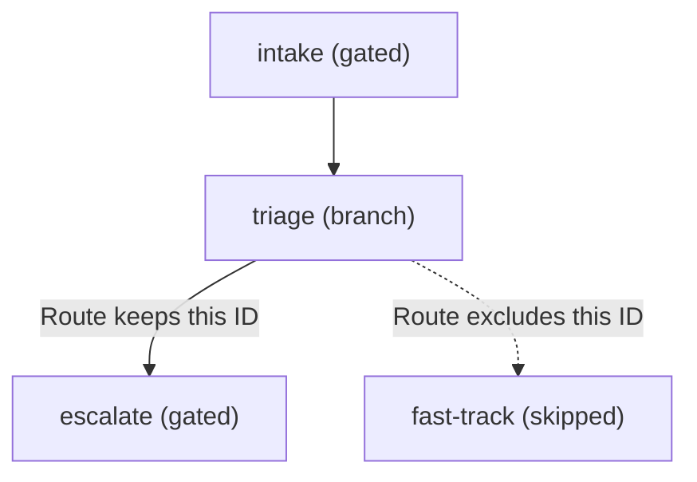
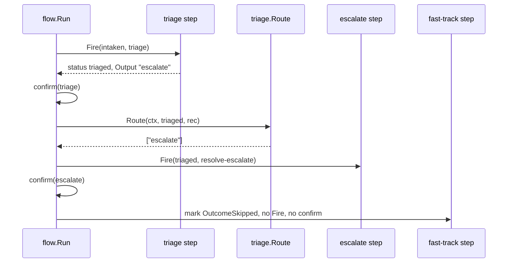

# Example: branch routing at runtime

This walkthrough shows a branch step choosing its own path. `triage`
is a branch step: it classifies an incoming ticket, then its `Route`
function reads the classification and keeps only one of two direct
dependents. The other dependent skips at once. The program builds and
runs against the module.

## The step graph



## Route picking the live path



## The program

```go
package main

import (
	"context"
	"fmt"

	"github.com/MiviaLabs/mivia-ai-sdk/flow"
	"github.com/MiviaLabs/mivia-ai-sdk/machine"
)

func main() {
	// triageAction classifies the incoming severity into an Output the
	// branch step's Route reads after the transition fires.
	triageAction := func(ctx context.Context, rec *machine.InOut) error {
		severity := rec.Input.(int)
		if severity >= 5 {
			rec.Output = "escalate"
		} else {
			rec.Output = "fast-track"
		}
		return nil
	}

	// route keeps only the dependent that matches the classification;
	// Run skips the other dependent at once.
	route := func(ctx context.Context, cur machine.Status, rec machine.InOut) ([]string, error) {
		return []string{rec.Output.(string)}, nil
	}

	graph, err := flow.New([]flow.Step{
		{ID: "intake", To: "intaken", Payload: "open the ticket"},
		{ID: "triage", Needs: []string{"intake"}, To: "triaged", Payload: "classify severity", Route: route},
		{ID: "fast-track", Needs: []string{"triage"}, To: "fast-tracked", Payload: "close within a day"},
		{ID: "escalate", Needs: []string{"triage"}, To: "escalated", Payload: "page the on-call"},
	}, nil)
	if err != nil {
		fmt.Println("new:", err)
		return
	}

	m, err := machine.New("queued",
		machine.Transition{From: "queued", To: "intaken", Trigger: "start"},
		machine.Transition{From: "intaken", To: "triaged", Trigger: "triage", OnEntry: triageAction},
		machine.Transition{From: "triaged", To: "fast-tracked", Trigger: "resolve-fast"},
		machine.Transition{From: "triaged", To: "escalated", Trigger: "resolve-escalate"},
	)
	if err != nil {
		fmt.Println("machine.New:", err)
		return
	}

	confirm := func(ctx context.Context, step flow.Step) error {
		fmt.Printf("confirm: step %q approved\n", step.ID)
		return nil
	}

	report, err := flow.Run(context.Background(), graph, m, machine.InOut{Input: 8}, confirm, nil, nil)
	if err != nil {
		fmt.Println("run:", err)
		return
	}

	fmt.Println("final status:", report.Status())
	fmt.Println("final output:", report.Record().Output)

	fastOutcome, _ := report.Outcome("fast-track")
	escalateOutcome, _ := report.Outcome("escalate")
	fmt.Println("fast-track outcome:", outcomeName(fastOutcome))
	fmt.Println("escalate outcome:", outcomeName(escalateOutcome))
}

func outcomeName(o flow.Outcome) string {
	switch o {
	case flow.OutcomeSucceeded:
		return "succeeded"
	case flow.OutcomeFailed:
		return "failed"
	case flow.OutcomeSkipped:
		return "skipped"
	default:
		return "unknown"
	}
}
```

## What the program shows

The program prints this output:

```
confirm: step "intake" approved
confirm: step "triage" approved
confirm: step "escalate" approved
final status: escalated
final output: escalate
fast-track outcome: skipped
escalate outcome: succeeded
```

`intake` runs, then `triage` fires its own transition and sets
`Output` to `"escalate"`, since the input severity is 8, at or above
the classification threshold of 5. `Run` calls `confirm` for `triage`
like any other step; a branch step is not a panel member, so the ack
gate still applies.

After `triage`'s ack confirms, `Run` calls `Route` with the post-fire
status and record. `Route` returns `["escalate"]`, so `Run` admits
`escalate` and marks `fast-track` `OutcomeSkipped` at once, without
firing its transition or calling its `confirm`. Only `escalate` prints
an approval line among the two dependents.

The final status is `escalated`, the status `escalate`'s transition
reaches. The final `machine.InOut.Output` still carries `"escalate"`,
the value `triage`'s `OnEntry` action set; `escalate`'s own transition
sets no `OnEntry` or `OnExit` action, so it leaves `Output` unchanged.
