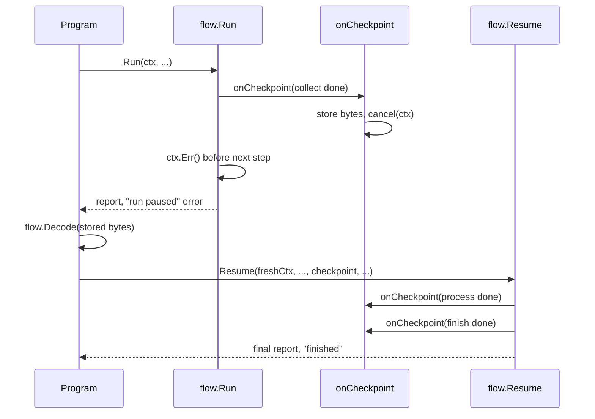

# Example: pause and resume a run from a checkpoint

This walkthrough runs a three-step sequential graph, pauses it after
the first step by canceling its `ctx`, then resumes it from the last
stored `Checkpoint`. The program builds and runs against the module.

## The pause-and-resume sequence



## The program

```go
package main

import (
	"context"
	"fmt"

	"github.com/MiviaLabs/mivia-ai-sdk/flow"
	"github.com/MiviaLabs/mivia-ai-sdk/machine"
)

func main() {
	graph, err := flow.New([]flow.Step{
		{ID: "collect", To: "collected", Payload: "collect the input"},
		{ID: "process", Needs: []string{"collect"}, To: "processed", Payload: "process the input"},
		{ID: "finish", Needs: []string{"process"}, To: "finished", Payload: "finish the run"},
	}, nil)
	if err != nil {
		fmt.Println("new:", err)
		return
	}

	m, err := machine.New("queued",
		machine.Transition{From: "queued", To: "collected", Trigger: "collect"},
		machine.Transition{From: "collected", To: "processed", Trigger: "process"},
		machine.Transition{From: "processed", To: "finished", Trigger: "finish"},
	)
	if err != nil {
		fmt.Println("machine.New:", err)
		return
	}

	confirm := func(ctx context.Context, step flow.Step) error {
		fmt.Printf("confirm: step %q approved\n", step.ID)
		return nil
	}

	ctx, cancel := context.WithCancel(context.Background())

	// stored holds the last Checkpoint Run delivered, Encode'd. Run
	// checks ctx before each step; canceling here, inside the hook
	// itself, lands the cancellation between the first and second
	// step, so the walk pauses mid-run instead of at the start.
	var stored []byte
	onCheckpoint := func(cp flow.Checkpoint) {
		data, err := cp.Encode()
		if err != nil {
			fmt.Println("encode:", err)
			return
		}
		stored = data
		fmt.Printf("checkpoint: status=%q done=%v\n", cp.Status, cp.Done)
		if len(cp.Done) == 1 {
			cancel()
		}
	}

	report, err := flow.Run(ctx, graph, m, machine.InOut{Input: "start the run"}, confirm, nil, onCheckpoint)
	fmt.Println("run error:", err)
	fmt.Println("paused status:", report.Status())

	checkpoint, err := flow.Decode(stored)
	if err != nil {
		fmt.Println("decode:", err)
		return
	}

	resumeCtx := context.Background()
	resumed, err := flow.Resume(resumeCtx, graph, m, checkpoint, confirm, nil, onCheckpoint)
	if err != nil {
		fmt.Println("resume:", err)
		return
	}

	fmt.Println("final status:", resumed.Status())
}
```

## What the program shows

`Run` checks `ctx` before it starts each step or wave in a graph of
more than one step. The `onCheckpoint` hook fires right after
`collect` resolves, so canceling `ctx` inside the hook lands the
cancellation exactly between `collect` and `process`. The next loop
iteration's `ctx.Err()` check catches it, and `Run` returns a
wrapped pause error instead of running `process` or `finish`.

The hook stores each delivered `Checkpoint`, `Encode`'d, in `stored`.
After `Run` returns, the program decodes the last stored checkpoint
with `flow.Decode` and passes it to `flow.Resume`, together with a
fresh, uncanceled `ctx`. `Resume` seeds its walk from the checkpoint's
`Status`, `Record`, and `Done` list, so it runs only `process` and
`finish`; `collect` never fires again.

The program prints:

```
confirm: step "collect" approved
checkpoint: status="collected" done=[collect]
run error: flow: run paused: context canceled
paused status: collected
confirm: step "process" approved
checkpoint: status="processed" done=[collect process]
confirm: step "finish" approved
checkpoint: status="finished" done=[collect finish process]
final status: finished
```

The paused run's status is `collected`, the status `collect`'s
transition reached before the pause. `Resume` picks up from there and
drives the walk to `finished`, the status `finish`'s transition
reaches. `Done`'s order is a sort of step IDs, not a completion order,
so the last checkpoint lists `collect`, `finish`, and `process` in
that order, not run order.
