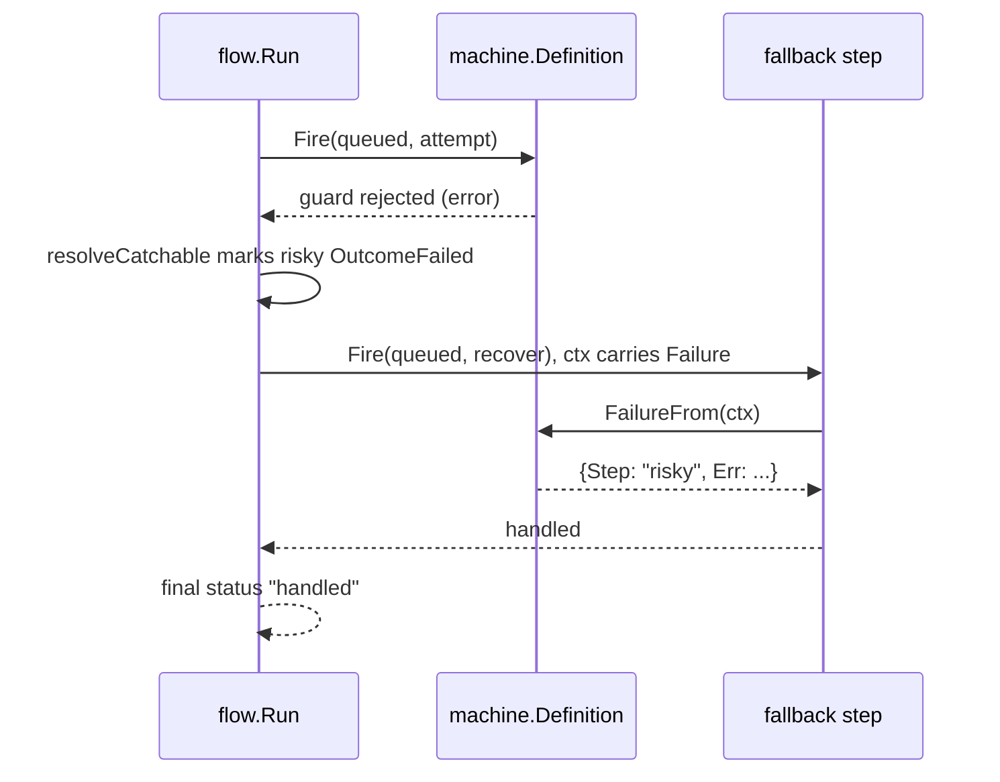

# Example: fallback admission after a failure

This walkthrough runs a two-step graph. The first step's guard always
rejects, so its `Fire` call fails. The second step declares
`AdmissionOnFailed` and catches that failure instead of aborting the
run. The program builds and runs against the module.

## The catch sequence



## The program

```go
package main

import (
	"context"
	"fmt"

	"github.com/MiviaLabs/mivia-ai-sdk/flow"
	"github.com/MiviaLabs/mivia-ai-sdk/machine"
)

func main() {
	graph, err := flow.New([]flow.Step{
		{ID: "risky", To: "rejected", Payload: "attempt the risky move"},
		{ID: "fallback", Needs: []string{"risky"}, To: "handled", When: flow.AdmissionOnFailed, Payload: "recover from risky"},
	}, nil)
	if err != nil {
		fmt.Println("new:", err)
		return
	}

	// alwaysReject fails every guard check, so risky's Fire always
	// returns a failureKindFire error.
	alwaysReject := func(ctx context.Context) (bool, error) {
		return false, nil
	}

	// reportFailure reads the Failure a caught Fire error leaves in
	// ctx and prints the failed step's ID and error.
	reportFailure := func(ctx context.Context, rec *machine.InOut) error {
		fail, ok := flow.FailureFrom(ctx)
		if !ok {
			fmt.Println("fallback: no failure in context")
			return nil
		}
		fmt.Printf("fallback: caught step %q: %v\n", fail.Step, fail.Err)
		return nil
	}

	m, err := machine.New("queued",
		machine.Transition{From: "queued", To: "rejected", Trigger: "attempt", Guard: alwaysReject},
		machine.Transition{From: "queued", To: "handled", Trigger: "recover", OnEntry: reportFailure},
	)
	if err != nil {
		fmt.Println("machine.New:", err)
		return
	}

	confirm := func(ctx context.Context, step flow.Step) error {
		fmt.Printf("confirm: step %q approved\n", step.ID)
		return nil
	}

	report, err := flow.Run(context.Background(), graph, m, machine.InOut{Input: "run the risky step"}, confirm, nil, nil)
	if err != nil {
		fmt.Println("run:", err)
		return
	}

	fmt.Println("final status:", report.Status())
	riskyOutcome, _ := report.Outcome("risky")
	fallbackOutcome, _ := report.Outcome("fallback")
	fmt.Println("risky outcome:", riskyOutcome)
	fmt.Println("fallback outcome:", fallbackOutcome)
}
```

## What the program shows

`risky` has no `Needs`, so it runs first, alone. Its transition's
`Guard` always returns `false`, so `machine.Fire` rejects the move and
`Run` marks `risky` `OutcomeFailed`. `fallback` needs `risky` and sets
`When: flow.AdmissionOnFailed`, so `Run` admits it once `risky`
resolves failed, instead of skipping it or aborting the walk.

`Run` injects the caught `Failure` into `fallback`'s transition
context before it fires. The transition's `OnEntry` action calls
`flow.FailureFrom(ctx)` and prints the failed step's ID and error.
`Run` then calls `confirm` for `fallback`, since it runs as an
ordinary singleton, not inside a panel.

The program prints:

```
fallback: caught step "risky": flow: step "risky": machine: guard rejected move from "queued" on "attempt"
confirm: step "fallback" approved
final status: handled
risky outcome: 1
fallback outcome: 0
```

`Run` never calls `confirm` for `risky`, since its `Fire` call fails
before `confirm` runs. The final status is `handled`, the status
`fallback`'s transition reaches. `report.Outcome` returns the
integer value of each step's `Outcome`: `1` is `OutcomeFailed` for
`risky`, `0` is `OutcomeSucceeded` for `fallback`. The run completes
with an error-free `Run` call; the caught failure never propagates
past `fallback`.
