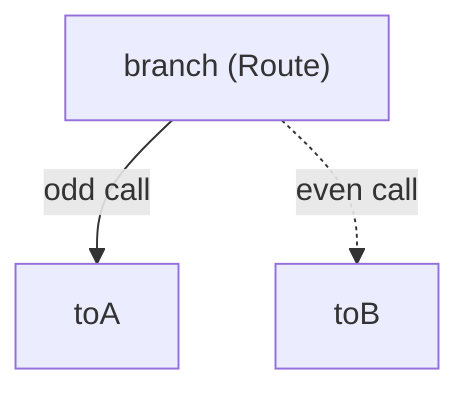
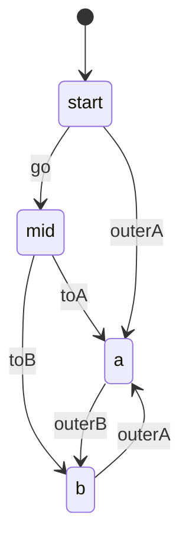

# Example: looping a child workflow

This walkthrough repeats one step's `Sub` child workflow until a guard
stops it. `drain`'s `Loop` policy runs its child four times, reading
`LoopStateFrom(ctx)` inside the guard to count completed iterations.
`machine` bans a self loop, so the child's final status must alternate
between two statuses; a branch step inside the child picks one of
them on each call. The program builds and runs against the module.

## The child workflow



## The status ping-pong



## The program

```go
package main

import (
	"context"
	"fmt"
	"sync/atomic"

	"github.com/MiviaLabs/mivia-ai-sdk/flow"
	"github.com/MiviaLabs/mivia-ai-sdk/machine"
)

func main() {
	// The child workflow's branch step routes to "toA" on an odd call
	// and "toB" on an even call, so its final status alternates
	// between statusA and statusB. machine bans a self loop, so the
	// parent's repeated fireFromChild call needs this alternation:
	// firing from statusA to statusB, then back from statusB to
	// statusA, never from a status to itself.
	var parity int32
	child, err := flow.New([]flow.Step{
		{ID: "branch", To: "mid", Route: func(ctx context.Context, cur machine.Status, rec machine.InOut) ([]string, error) {
			if atomic.AddInt32(&parity, 1)%2 == 1 {
				return []string{"toA"}, nil
			}
			return []string{"toB"}, nil
		}},
		{ID: "toA", Needs: []string{"branch"}, To: "a"},
		{ID: "toB", Needs: []string{"branch"}, To: "b"},
	}, nil)
	if err != nil {
		fmt.Println("flow.New (child):", err)
		return
	}

	graph, err := flow.New([]flow.Step{
		{
			ID:  "drain",
			Sub: child,
			Loop: &flow.LoopPolicy{
				Guard: func(ctx context.Context) (bool, error) {
					state, _ := flow.LoopStateFrom(ctx)
					fmt.Printf("iteration %d complete\n", state.Iteration)
					return state.Iteration < 3, nil
				},
			},
		},
	}, nil)
	if err != nil {
		fmt.Println("flow.New (parent):", err)
		return
	}

	m, err := machine.New("start",
		machine.Transition{From: "start", To: "mid", Trigger: "go"},
		machine.Transition{From: "mid", To: "a", Trigger: "toA"},
		machine.Transition{From: "mid", To: "b", Trigger: "toB"},
		machine.Transition{From: "start", To: "a", Trigger: "outerA"},
		machine.Transition{From: "a", To: "b", Trigger: "outerB"},
		machine.Transition{From: "b", To: "a", Trigger: "outerA"},
	)
	if err != nil {
		fmt.Println("machine.New:", err)
		return
	}

	confirm := func(ctx context.Context, step flow.Step) error {
		fmt.Printf("confirm: step %q approved\n", step.ID)
		return nil
	}

	report, err := flow.Run(context.Background(), graph, m, machine.InOut{Input: "batch queue"}, confirm, nil, nil)
	if err != nil {
		fmt.Println("run:", err)
		return
	}

	fmt.Println("final status:", report.Status())
}
```

## What the program shows

The program prints this output:

```
confirm: step "branch" approved
confirm: step "toA" approved
iteration 0 complete
confirm: step "branch" approved
confirm: step "toB" approved
iteration 1 complete
confirm: step "branch" approved
confirm: step "toA" approved
iteration 2 complete
confirm: step "branch" approved
confirm: step "toB" approved
iteration 3 complete
confirm: step "drain" approved
final status: b
```

Each iteration runs the child workflow to completion first: `branch`
fires, `Run` calls `confirm` for it, then the routed step (`toA` or
`toB`) fires and confirms too. Only after the child finishes does
`drain`'s own parent transition fire, from the loop's current status
to the child's final status.

Before each guard call, `Run` injects a `LoopState` into `ctx`, and
`LoopStateFrom` reads it back inside the guard closure. `Iteration`
counts completed iterations, so the guard call after the first
iteration reports `0`. The guard returns true while `Iteration` stays
below 3, so the loop runs a fourth iteration before the guard call
that reports `3` stops it.

`drain` itself confirms once, after the loop ends; `Run` calls
`confirm` for the loop step's own transition, not once per iteration.
The final status is `b`, the status the fourth iteration's `toB` step
reaches through the ping-pong machine's alternating rows.
