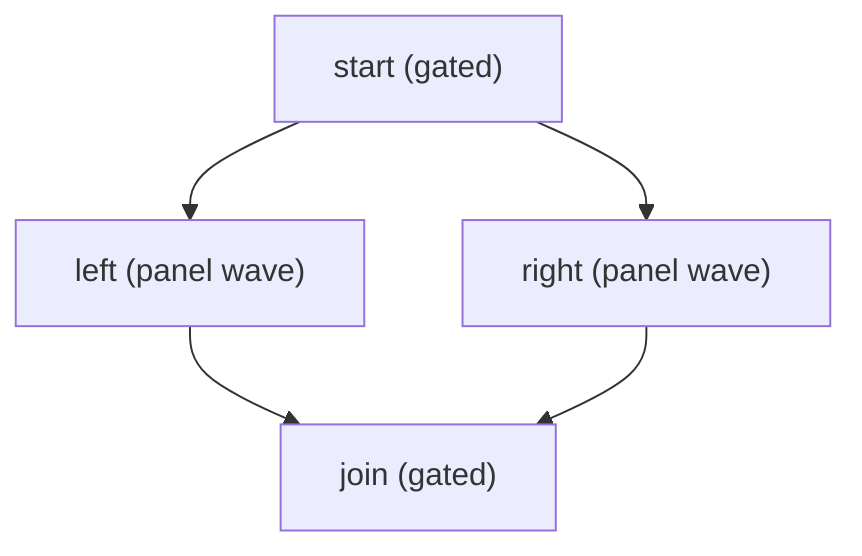
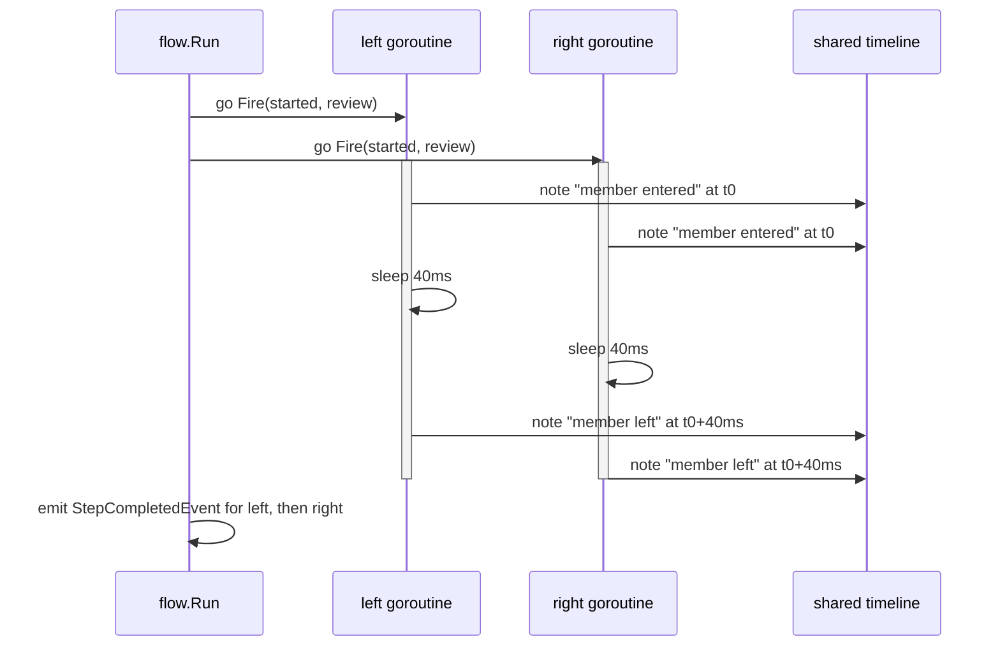

# Example: a concurrent panel wave

This walkthrough goes deeper on one panel wave than
[flow-runner.md](flow-runner.md) does. Two steps, `left` and `right`,
share a panel and fire the same transition row at the same time, each
in its own goroutine. The program marks each call's start and end time
on one shared timeline, so the overlap is visible in the output, not
just asserted. The program also subscribes to an `events.Bus` and
prints the `StepCompletedEvent` each step emits. The program builds
and runs against the module.

## The step graph



## Both members firing at once



## The program

```go
package main

import (
	"context"
	"fmt"
	"sync"
	"time"

	"github.com/MiviaLabs/mivia-ai-sdk/events"
	"github.com/MiviaLabs/mivia-ai-sdk/flow"
	"github.com/MiviaLabs/mivia-ai-sdk/machine"
)

func main() {
	graph, err := flow.New([]flow.Step{
		{ID: "start", To: "started", Payload: "open the review"},
		{ID: "left", Needs: []string{"start"}, To: "reviewed", Payload: "review from the left"},
		{ID: "right", Needs: []string{"start"}, To: "reviewed", Payload: "review from the right"},
		{ID: "join", Needs: []string{"left", "right"}, To: "joined", Payload: "merge the reviews"},
	}, []flow.Panel{{"left", "right"}})
	if err != nil {
		fmt.Println("new:", err)
		return
	}

	start := time.Now()
	var mu sync.Mutex
	var timeline []string
	note := func(label string) {
		mu.Lock()
		timeline = append(timeline, fmt.Sprintf("%s at %v", label, time.Since(start).Round(time.Millisecond)))
		mu.Unlock()
	}

	// review fires once per panel member, concurrently. Neither call can
	// tell which member it belongs to, so it only marks entry and exit
	// times on one shared, mutex-guarded timeline.
	review := func(ctx context.Context, rec *machine.InOut) error {
		note("member entered")
		time.Sleep(40 * time.Millisecond)
		note("member left")
		return nil
	}

	m, err := machine.New("queued",
		machine.Transition{From: "queued", To: "started", Trigger: "begin"},
		machine.Transition{From: "started", To: "reviewed", Trigger: "review", OnEntry: review},
		machine.Transition{From: "reviewed", To: "joined", Trigger: "join"},
	)
	if err != nil {
		fmt.Println("machine.New:", err)
		return
	}

	confirm := func(ctx context.Context, step flow.Step) error {
		fmt.Printf("confirm: step %q approved\n", step.ID)
		return nil
	}

	bus := events.New()
	if err := bus.Subscribe(flow.StepCompletedEvent, func(ctx context.Context, e events.Event) error {
		fmt.Println("event:", e.Data)
		return nil
	}); err != nil {
		fmt.Println("subscribe:", err)
		return
	}

	report, err := flow.Run(context.Background(), graph, m, machine.InOut{Input: "review request"}, confirm, bus, nil)
	if err != nil {
		fmt.Println("run:", err)
		return
	}

	fmt.Println("final status:", report.Status())
	fmt.Println("timeline:")
	for _, line := range timeline {
		fmt.Println(" ", line)
	}
}
```

## What the program shows

The program prints this output:

```
confirm: step "start" approved
event: step start completed
event: step left completed
event: step right completed
confirm: step "join" approved
event: step join completed
final status: joined
timeline:
  member entered at 0s
  member entered at 0s
  member left at 40ms
  member left at 40ms
```

Both `member entered` lines land at the same rounded time, before
either `member left` line. `left` and `right` overlap in wall-clock
time; neither call waits for the other's `OnEntry` action to finish
first. This is `Run`'s panel contract from
[flow.md](../packages/flow.md): a wave fires every member's `Guard`,
`OnExit`, and `OnEntry` once each, concurrently, through the one
shared transition row.

`Run` never calls `confirm` for `left` or `right`, so only `start` and
`join` print an approval line. `Run` still emits one
`StepCompletedEvent` per panel member, in the panel's declaration
order, once the whole wave resolves: `left` before `right`. Event
emission runs after `wg.Wait()` returns, so its order is fixed even
though the two `Fire` calls it reports on ran concurrently.

The final status is `joined`, the status the `join` step's transition
reaches.
