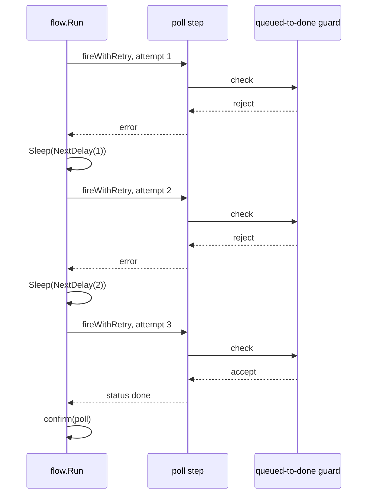

# Example: retrying a flaky step

This walkthrough drives one step through a flaky dependency. The
`poll` step's transition has a guard that rejects the first two
attempts and accepts the third. A `Retry` policy on the step retries
its own `Fire` call, backing off between attempts. The program builds
and runs against the module.

## The retry sequence



## The program

```go
package main

import (
	"context"
	"fmt"
	"time"

	"github.com/MiviaLabs/mivia-ai-sdk/flow"
	"github.com/MiviaLabs/mivia-ai-sdk/machine"
)

func main() {
	attempts := 0

	// The guard rejects the first two calls and allows the third,
	// simulating a flaky dependency that clears on its own.
	m, err := machine.New("queued",
		machine.Transition{
			From:    "queued",
			To:      "done",
			Trigger: "poll",
			Guard: func(context.Context) (bool, error) {
				attempts++
				fmt.Printf("attempt %d: guard checked\n", attempts)
				if attempts < 3 {
					return false, nil
				}
				return true, nil
			},
		},
	)
	if err != nil {
		fmt.Println("machine.New:", err)
		return
	}

	graph, err := flow.New([]flow.Step{
		{
			ID:      "poll",
			To:      "done",
			Payload: "poll the flaky dependency",
			Retry: &flow.RetryPolicy{
				MaxAttempts: 3,
				BaseDelay:   10 * time.Millisecond,
				MaxDelay:    time.Second,
				// Sleep replaces the real wait with a print, so the
				// example stays fast and deterministic; NextDelay still
				// computes the real backoff passed in.
				Sleep: func(ctx context.Context, d time.Duration) {
					fmt.Printf("backoff: would wait %s, skipped for this example\n", d)
				},
			},
		},
	}, nil)
	if err != nil {
		fmt.Println("flow.New:", err)
		return
	}

	confirm := func(ctx context.Context, step flow.Step) error {
		fmt.Printf("confirm: step %q approved\n", step.ID)
		return nil
	}

	report, err := flow.Run(context.Background(), graph, m, machine.InOut{Input: "check dependency"}, confirm, nil, nil)
	if err != nil {
		fmt.Println("run:", err)
		return
	}

	fmt.Println("final status:", report.Status())
	outcome, _ := report.Outcome("poll")
	fmt.Println("poll outcome:", outcomeName(outcome))
}

func outcomeName(o flow.Outcome) string {
	switch o {
	case flow.OutcomeSucceeded:
		return "succeeded"
	case flow.OutcomeFailed:
		return "failed"
	case flow.OutcomeSkipped:
		return "skipped"
	default:
		return "unknown"
	}
}
```

## What the program shows

The program prints this output:

```
attempt 1: guard checked
backoff: would wait 10ms, skipped for this example
attempt 2: guard checked
backoff: would wait 20ms, skipped for this example
attempt 3: guard checked
confirm: step "poll" approved
final status: done
poll outcome: succeeded
```

`fireWithRetry` wraps `poll`'s own `Fire` call in the `Retry` policy's
loop. The guard rejects the first two attempts, so `Fire` fails twice
and `Run` never calls `confirm` for either failed attempt.

Between attempts, `fireWithRetry` calls `RetryPolicy.NextDelay` for
the backoff, then the policy's `Sleep` hook. `NextDelay(1)` returns
`BaseDelay` unchanged: 10ms. `NextDelay(2)` doubles it once: 20ms.
This example's `Sleep` prints the computed duration instead of
waiting, so the program runs fast and stays deterministic; a caller
without a custom `Sleep` gets a real, context-aware wait through
`defaultSleep`.

The third attempt's guard accepts the move, so `Fire` succeeds and
`Run` calls `confirm` for `poll`. `MaxAttempts` is 3, matching the
guard's own threshold, so the retry loop has just enough budget to
reach the successful attempt. The final status is `done`, and `poll`
resolves `OutcomeSucceeded`.
