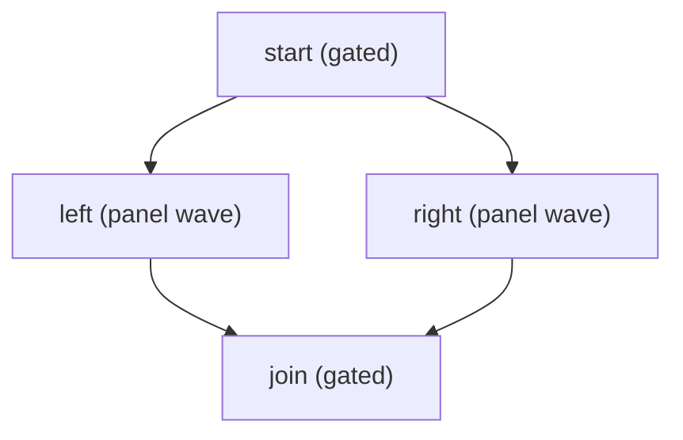
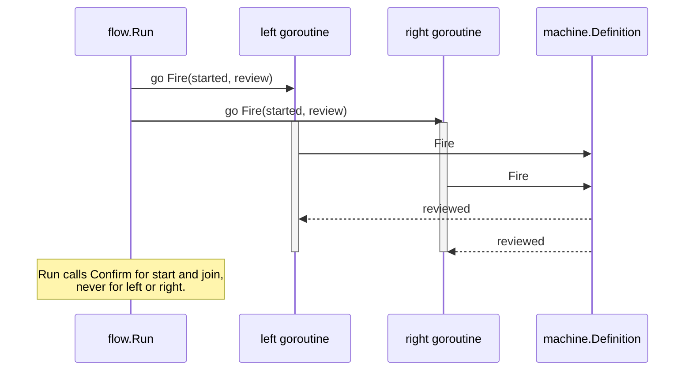

# Example: the flow runner

This walkthrough drives a step graph end to end. A root step gates on
`Confirm`, then a two-member panel runs as one wave, then a closing
step gates on `Confirm` again. The program builds and runs against
the module.

## The program

```go
package main

import (
	"context"
	"fmt"

	"github.com/MiviaLabs/mivia-ai-sdk/flow"
	"github.com/MiviaLabs/mivia-ai-sdk/machine"
)

func main() {
	graph, err := flow.New([]flow.Step{
		{ID: "start", To: "started", Payload: "open the review"},
		{ID: "left", Needs: []string{"start"}, To: "reviewed", Payload: "review from the left"},
		{ID: "right", Needs: []string{"start"}, To: "reviewed", Payload: "review from the right"},
		{ID: "join", Needs: []string{"left", "right"}, To: "joined", Payload: "merge the reviews"},
	}, []flow.Panel{{"left", "right"}})
	if err != nil {
		fmt.Println("new:", err)
		return
	}

	m, err := machine.New("queued",
		machine.Transition{From: "queued", To: "started", Trigger: "begin"},
		machine.Transition{From: "started", To: "reviewed", Trigger: "review"},
		machine.Transition{From: "reviewed", To: "joined", Trigger: "join"},
	)
	if err != nil {
		fmt.Println("machine.New:", err)
		return
	}

	// confirm approves every gated step: start and join. Run never
	// calls confirm for left or right, since they share a two-member
	// panel wave.
	confirm := func(ctx context.Context, step flow.Step) error {
		fmt.Printf("confirm: step %q approved\n", step.ID)
		return nil
	}

	status, out, err := flow.Run(context.Background(), graph, m, machine.InOut{Input: "review request"}, confirm, nil)
	if err != nil {
		fmt.Println("run:", err)
		return
	}

	fmt.Println("final status:", status)
	fmt.Println("final input:", out.Input)
	fmt.Println("final output:", out.Output)
}
```

## The step graph



## One panel wave, fired concurrently



## What the program shows

`start` and `join` each run alone; `Run` calls `confirm` after each
one's transition fires, and the program prints one approval line per
call. `left` and `right` share one panel, so `Run` schedules them as
one wave once both are ready: `machine.Fire` runs once per member,
concurrently, in its own goroutine, through the one transition row
their shared `To` selects. `Run` never calls `confirm` for a wave of
two or more members, so the panel members produce no approval line.
This matches the panel contract documented in
[flow.md](../packages/flow.md) and reused by
[agent.md](../packages/agent.md): a panel step never reaches a
`Confirm` call.

The final status is `joined`, the status the `join` step's transition
reaches. The final `machine.InOut` carries the `Input` value set
before the run and a nil `Output`, since none of the four steps'
transitions in this machine set an `OnEntry` or `OnExit` action that
writes to `Output`.
