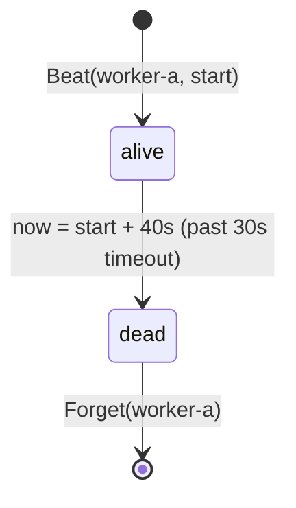

# Example: heartbeat liveness

This walkthrough tracks two ids on one `heartbeat.Monitor` with a
30-second timeout. Both ids beat at fixed times, so the example stays
deterministic. One id goes silent past the timeout while the other
stays inside it; `Forget` then drops the silent id from the tracked
set. The program builds and runs against the module.

## The liveness transition



## The program

```go
package main

import (
	"fmt"
	"time"

	"github.com/MiviaLabs/mivia-ai-sdk/heartbeat"
)

func main() {
	// A 30-second timeout: an id is dead after 30 seconds of silence.
	mon, err := heartbeat.New(30 * time.Second)
	if err != nil {
		fmt.Println("new:", err)
		return
	}

	start := time.Date(2026, time.January, 1, 0, 0, 0, 0, time.UTC)

	// worker-a beats at the start time.
	if err := mon.Beat("worker-a", start); err != nil {
		fmt.Println("beat worker-a:", err)
		return
	}

	// worker-b beats 20 seconds later, well inside the timeout.
	later := start.Add(20 * time.Second)
	if err := mon.Beat("worker-b", later); err != nil {
		fmt.Println("beat worker-b:", err)
		return
	}

	// now is 40 seconds past start: worker-a is 40 seconds silent,
	// past the 30-second timeout. worker-b is only 20 seconds silent.
	now := start.Add(40 * time.Second)

	fmt.Println("worker-a alive:", mon.Alive("worker-a", now))
	fmt.Println("worker-b alive:", mon.Alive("worker-b", now))
	fmt.Println("dead:", mon.Dead(now))

	// Forget worker-a; it drops out of the tracked set entirely.
	mon.Forget("worker-a")
	fmt.Println("dead after forget:", mon.Dead(now))
}
```

## What the program shows

`Alive` compares `now` against each id's last beat and the fixed
timeout: worker-a's last beat is 40 seconds behind `now`, past the
30-second timeout, so `Alive` reports false. worker-b's last beat is
only 20 seconds behind, so `Alive` reports true. `Dead` returns the
sorted ids past the timeout, so it lists only `worker-a`. After
`Forget("worker-a")`, the id leaves the tracked set entirely, so
`Dead` returns an empty list, not a list with worker-a marked alive
again. The program prints `worker-a alive: false`, `worker-b alive:
true`, `dead: [worker-a]`, and `dead after forget: []`.
