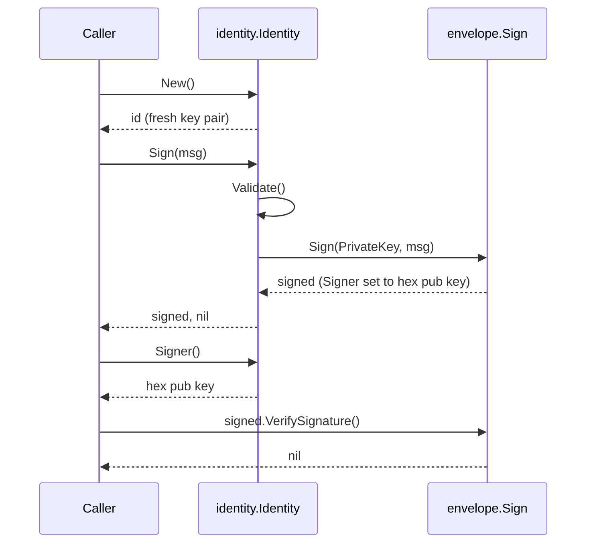

# Example: identity agent key

This walkthrough generates a fresh agent key with `identity.New`,
signs an `envelope.Message` with `Identity.Sign`, and compares the
signed message's `Signer` field against `Identity.Signer`'s hex
string. `Identity.Sign` validates the key, then wraps `envelope.Sign`;
it never calls `ed25519.Sign` directly. The program builds and runs
against the module.

## The sign sequence



## The program

```go
package main

import (
	"fmt"

	"github.com/MiviaLabs/mivia-ai-sdk/envelope"
	"github.com/MiviaLabs/mivia-ai-sdk/identity"
)

func main() {
	id, err := identity.New()
	if err != nil {
		fmt.Println("new:", err)
		return
	}

	msg := envelope.Message{
		Version:    envelope.Version,
		ID:         "msg-1",
		ThreadID:   "task-42",
		Intent:     envelope.IntentAssert,
		Epistemic:  envelope.EpistemicInferred,
		Provenance: envelope.Provenance{Source: "model:self"},
		Payload:    "The build is green.",
	}

	signed, err := id.Sign(msg)
	if err != nil {
		fmt.Println("sign:", err)
		return
	}

	fmt.Println("signer matches:", signed.Signer == id.Signer())

	err = signed.VerifySignature()
	fmt.Println("verify error:", err)
}
```

## What the program shows

`identity.New` generates a fresh ed25519 key pair. `id.Sign` validates
the key, then calls `envelope.Sign`, which stamps `Message.Signer`
with the hex-encoded public key and writes the signature. `id.Signer`
derives the same hex string straight from the private key, so it
matches `signed.Signer` without a second envelope round trip.
`signed.VerifySignature` recomputes the signature over the message
and compares it against the stored one, returning nil for a message
that matches. The program prints `signer matches: true` and `verify
error: <nil>`.
