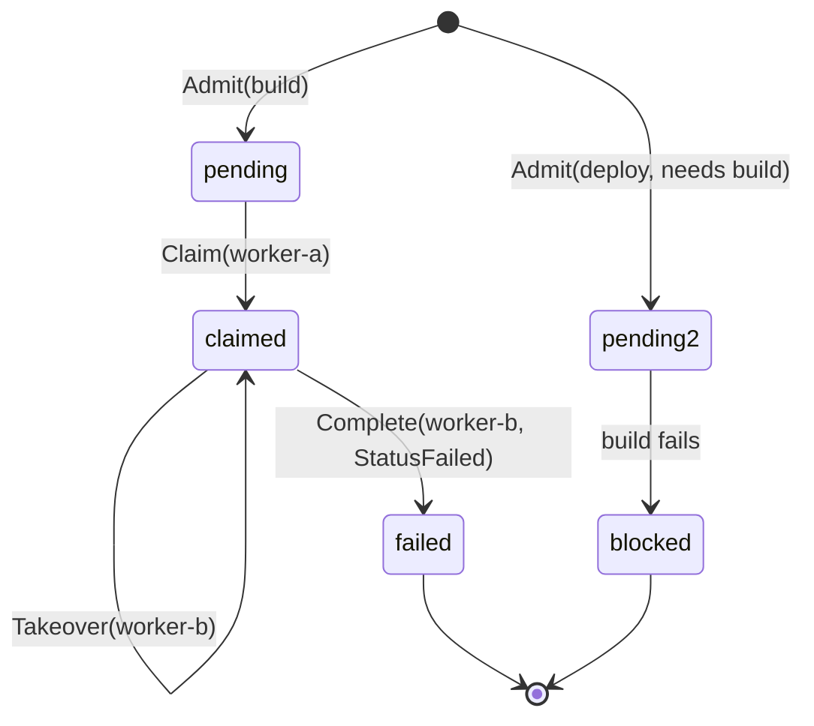

# Example: ledger admission lifecycle

This walkthrough admits a `build` task and a `deploy` task that needs
it. `worker-a` claims `build`, renews its lease once, then goes
silent. `worker-b` takes the lease over after it expires, and
completes `build` as failed. The failure blocks `deploy`, the
dependent task. The program builds and runs against the module.

## The task lifecycle



## The program

```go
package main

import (
	"context"
	"fmt"
	"time"

	"github.com/MiviaLabs/mivia-ai-sdk/ledger"
)

func main() {
	l, err := ledger.New(nil, nil) // nil Store defaults to MemStore
	if err != nil {
		fmt.Println("new:", err)
		return
	}

	ctx := context.Background()
	now := time.Date(2026, time.January, 1, 0, 0, 0, 0, time.UTC)

	// Admit the parent task and a dependent task that names it in needs.
	if _, err := l.Admit(ctx, "scheduler", "build", 1, "build the artifact", now); err != nil {
		fmt.Println("admit build:", err)
		return
	}
	if _, err := l.Admit(ctx, "scheduler", "deploy", 1, "deploy the artifact", now, "build"); err != nil {
		fmt.Println("admit deploy:", err)
		return
	}

	// worker-a claims build with a one-minute lease.
	fence, err := l.Claim(ctx, "scheduler", "build", "worker-a", time.Minute, now)
	if err != nil {
		fmt.Println("claim:", err)
		return
	}
	fmt.Println("claimed fence:", fence)

	// worker-a renews the lease 30 seconds later, still inside the window.
	renewAt := now.Add(30 * time.Second)
	if err := l.Renew(ctx, "scheduler", "build", "worker-a", fence, time.Minute, renewAt); err != nil {
		fmt.Println("renew:", err)
		return
	}

	// worker-a goes silent; time advances past the renewed lease.
	takeoverAt := renewAt.Add(2 * time.Minute)
	newFence, err := l.Takeover(ctx, "scheduler", "build", "worker-b", time.Minute, takeoverAt)
	if err != nil {
		fmt.Println("takeover:", err)
		return
	}
	fmt.Println("takeover fence:", newFence)

	// worker-b completes build as failed under the new fence.
	completeAt := takeoverAt.Add(time.Second)
	if err := l.Complete(ctx, "scheduler", "build", "worker-b", newFence, ledger.StatusFailed, completeAt); err != nil {
		fmt.Println("complete:", err)
		return
	}

	// deploy needed build, so it is now blocked.
	blockedBy, blocked, err := l.Blocked(ctx, "deploy")
	if err != nil {
		fmt.Println("blocked:", err)
		return
	}
	fmt.Println("deploy blocked:", blocked)
	fmt.Println("deploy blocked by:", blockedBy)

	state, _, err := l.State(ctx, "deploy")
	if err != nil {
		fmt.Println("state:", err)
		return
	}
	fmt.Println("deploy status:", state.Status)
}
```

## What the program shows

`Claim` returns fence `1` for `worker-a`. `Renew` extends the lease
under that same fence, so it still applies. `Takeover` fires two
minutes after the renewal, well past the one-minute lease `Renew`
set, so it succeeds and returns fence `2` for `worker-b`. `Complete`
then marks `build` `StatusFailed` under fence `2`, the current one.

`Complete` on a failed task walks the dependency graph and blocks
every transitive dependent. `deploy` names `build` in `needs`, so
`Blocked` reports it blocked, with `build` as the blocking key.
`State` confirms `deploy`'s status is `blocked`, not `pending`. The
program prints `claimed fence: 1`, `takeover fence: 2`, `deploy
blocked: true`, `deploy blocked by: build`, and `deploy status:
blocked`.
