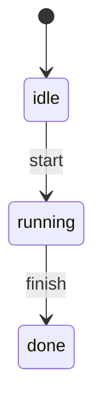

# Example: the machine flow

This walkthrough builds a three-status machine: idle, running, done.
A guard on the running-to-done transition rejects the first attempt
and allows every attempt after. The program builds and runs against
the module.

## The state diagram



## The program

```go
package main

import (
	"context"
	"fmt"

	"github.com/MiviaLabs/mivia-ai-sdk/machine"
)

func main() {
	attempts := 0

	// A guard on running->done rejects the first attempt, then
	// allows every attempt after.
	d, err := machine.New(
		machine.Status("idle"),
		machine.Transition{
			From:    machine.Status("idle"),
			To:      machine.Status("running"),
			Trigger: machine.Trigger("start"),
		},
		machine.Transition{
			From:    machine.Status("running"),
			To:      machine.Status("done"),
			Trigger: machine.Trigger("finish"),
			Guard: func(context.Context) (bool, error) {
				attempts++
				return attempts > 1, nil
			},
		},
	)
	if err != nil {
		fmt.Println("new:", err)
		return
	}

	ctx := context.Background()

	// idle -> running: no guard on this row, so it always succeeds.
	status, _, err := d.Fire(ctx, machine.Status("idle"), machine.Trigger("start"), machine.InOut{})
	if err != nil {
		fmt.Println("fire start:", err)
		return
	}
	fmt.Println("after start:", status)

	// running -> done, first try: the guard rejects it.
	status, _, err = d.Fire(ctx, status, machine.Trigger("finish"), machine.InOut{})
	if err != nil {
		fmt.Println("fire finish (first try):", err)
	} else {
		fmt.Println("after finish (first try):", status)
	}

	// running -> done, second try: the guard allows it.
	status, _, err = d.Fire(ctx, machine.Status("running"), machine.Trigger("finish"), machine.InOut{})
	if err != nil {
		fmt.Println("fire finish (second try):", err)
		return
	}
	fmt.Println("after finish (second try):", status)
}
```

## What the program shows

The first `Fire` call moves the record from idle to running; no guard
sits on that row, so it always succeeds. The second call attempts
running-to-done and fails: the guard counts its own calls and rejects
the first one. `Fire` returns an error and leaves the status at
running, so the third call retries from running, not from a moved
status. The guard now allows the move, and `Fire` returns done. A
guard runs before `OnExit` and `OnEntry`, so a rejected guard never
triggers either action.
