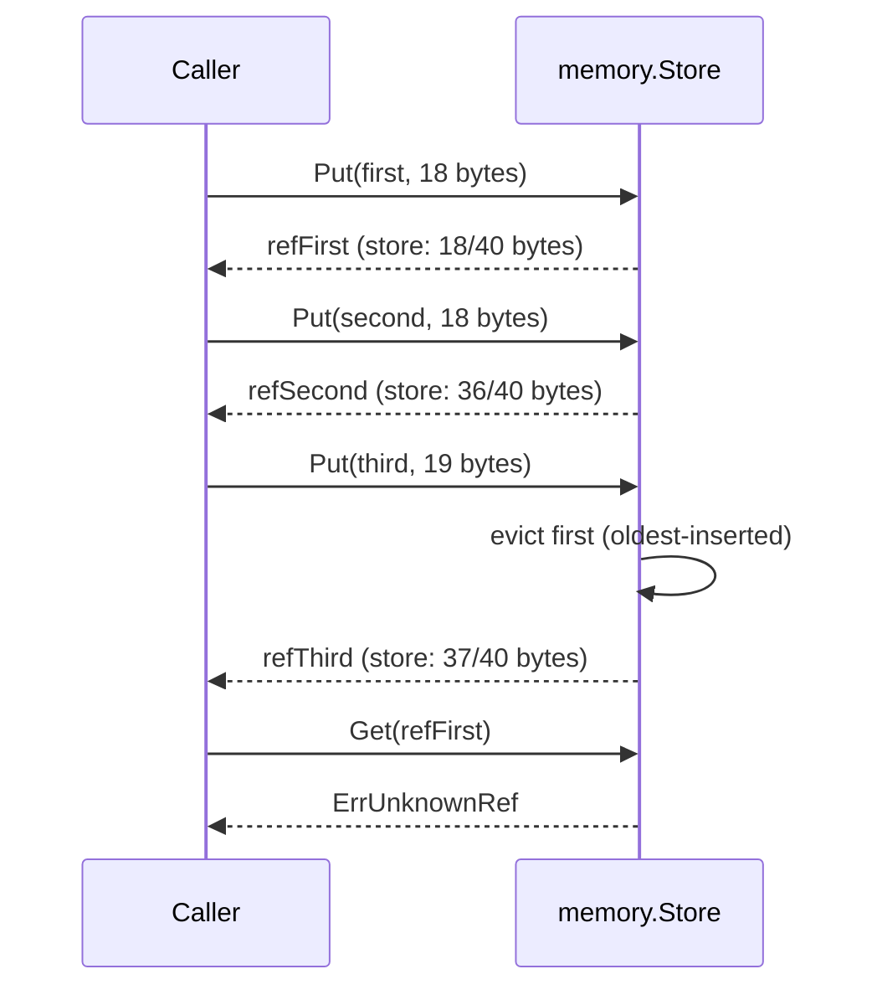

# Example: memory context store

This walkthrough puts three blobs into a `memory.Store` under a
40-byte budget. The first two blobs fit together. The third forces
the store to evict the oldest-inserted blob before it stores the
third. The program builds and runs against the module.

## The eviction sequence



## The program

```go
package main

import (
	"errors"
	"fmt"

	"github.com/MiviaLabs/mivia-ai-sdk/memory"
)

func main() {
	// A 40-byte budget: small enough that a third blob evicts the first.
	store, err := memory.New(40)
	if err != nil {
		fmt.Println("new:", err)
		return
	}

	first := []byte("alpha payload one")   // 18 bytes
	second := []byte("beta payload two!!") // 18 bytes
	third := []byte("gamma payload three") // 19 bytes

	refFirst, err := store.Put(first)
	if err != nil {
		fmt.Println("put first:", err)
		return
	}
	fmt.Println("put first:", refFirst)

	refSecond, err := store.Put(second)
	if err != nil {
		fmt.Println("put second:", err)
		return
	}
	fmt.Println("put second:", refSecond)

	// first + second is 36 bytes, under the 40-byte budget so far.
	// third is 19 bytes; first+second+third is 55 bytes, over budget.
	// Put evicts the oldest-inserted blob (first) until third fits.
	refThird, err := store.Put(third)
	if err != nil {
		fmt.Println("put third:", err)
		return
	}
	fmt.Println("put third:", refThird)

	blob, err := store.Get(refFirst)
	if errors.Is(err, memory.ErrUnknownRef) {
		fmt.Println("get first: evicted")
	} else if err != nil {
		fmt.Println("get first:", err)
	} else {
		fmt.Println("get first:", string(blob))
	}

	blob, err = store.Get(refSecond)
	if err != nil {
		fmt.Println("get second:", err)
	} else {
		fmt.Println("get second:", string(blob))
	}

	blob, err = store.Get(refThird)
	if err != nil {
		fmt.Println("get third:", err)
	} else {
		fmt.Println("get third:", string(blob))
	}
}
```

## What the program shows

`Put` stores `first` and `second` without eviction; together they hold
36 of the 40-byte budget. `Put(third)` needs 19 more bytes, which
would push the store to 55 bytes. `Put` evicts blobs in insertion
order until `third` fits, so it drops `first` and keeps `second`. The
store then holds `second` and `third`, at 37 of 40 bytes.

`Get(refFirst)` returns `memory.ErrUnknownRef` because eviction removed
that blob. `Get(refSecond)` and `Get(refThird)` both return their
original bytes, unchanged by the eviction. The program prints:

```
put first: sha256:66f84a35581d60389a9fc38b808fb8a4486755d48cd02ff13a68d3115688fca3
put second: sha256:c4d7dbb98dffc2581f8ba373509b173d41319bedd94c0c4d4a3dcceaba4723d7
put third: sha256:69eab6c3272eb4de20f11fdb15fcd334ce208291cf4f24a562104b0fd5c6586d
get first: evicted
get second: beta payload two!!
get third: gamma payload three
```

Each ref is a `sha256:` hash of the blob's own content, computed by
`envelope.ContextRef`. The exact hash is deterministic for a given
input, so a caller can reproduce these refs from the same three
strings.
