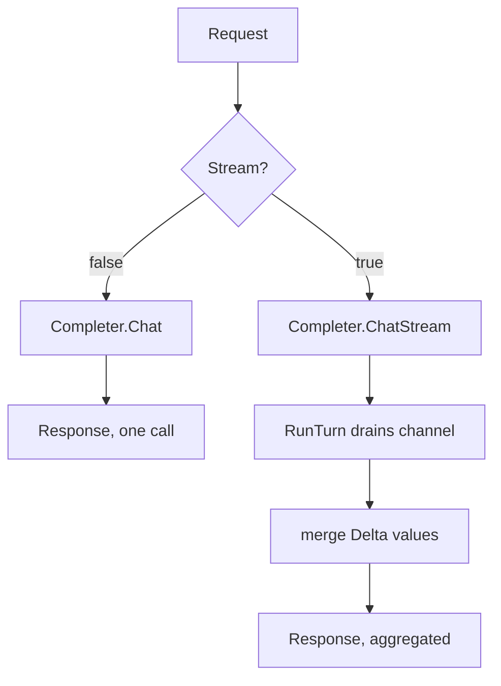

# Example: provider Completer turn

This walkthrough calls `RunTurn` twice against one hand-written
`provider.Completer`. The first call sets `Request.Stream` to false,
so `RunTurn` dispatches to `Chat`. The second call sets it to true, so
`RunTurn` dispatches to `ChatStream`, drains the channel, and
aggregates the streamed deltas into one `Response`. The program builds
and runs against the module.

## The two dispatch paths



## The program

```go
package main

import (
	"context"
	"fmt"

	"github.com/MiviaLabs/mivia-ai-sdk/provider"
)

// fakeCompleter answers every turn without a network call: Chat returns
// a canned Response, ChatStream streams it as two Chunk values.
type fakeCompleter struct{}

func (fakeCompleter) Name() string { return "fake" }

func (fakeCompleter) Chat(ctx context.Context, req provider.Request) (provider.Response, error) {
	return provider.Response{
		Model:        req.Model,
		Message:      provider.Message{Role: provider.RoleAssistant, Content: "sync reply"},
		FinishReason: "stop",
	}, nil
}

func (fakeCompleter) ChatStream(ctx context.Context, req provider.Request) (<-chan provider.Chunk, error) {
	ch := make(chan provider.Chunk, 3)
	ch <- provider.Chunk{Delta: "stream "}
	ch <- provider.Chunk{Delta: "reply"}
	ch <- provider.Chunk{Done: true, FinishReason: "stop"}
	close(ch)
	return ch, nil
}

func main() {
	c := fakeCompleter{}
	messages := []provider.Message{{Role: provider.RoleUser, Content: "hello"}}

	// Stream: false dispatches RunTurn to Chat.
	syncReq := provider.Request{Model: "demo", Messages: messages, Stream: false}
	syncResp, err := provider.RunTurn(context.Background(), c, syncReq)
	if err != nil {
		fmt.Println("sync run turn:", err)
		return
	}
	fmt.Println("sync content:", syncResp.Message.Content)
	fmt.Println("sync finish reason:", syncResp.FinishReason)

	// Stream: true dispatches RunTurn to ChatStream, drains the channel,
	// and aggregates the Delta values into one Response.
	streamReq := provider.Request{Model: "demo", Messages: messages, Stream: true}
	streamResp, err := provider.RunTurn(context.Background(), c, streamReq)
	if err != nil {
		fmt.Println("stream run turn:", err)
		return
	}
	fmt.Println("stream content:", streamResp.Message.Content)
	fmt.Println("stream finish reason:", streamResp.FinishReason)
}
```

## What the program shows

The sync call sets `Stream: false`, so `RunTurn` calls `Chat`
directly and returns its canned `Response` unchanged: content is
`sync reply`.

The stream call sets `Stream: true`, so `RunTurn` calls `ChatStream`
and drains the returned channel. It reads two `Delta` chunks,
`"stream "` and `"reply"`, then a final chunk with `Done: true`.
`RunTurn` concatenates the deltas in arrival order into one
`Message.Content`, so the aggregated content is `stream reply`, the
same text as the two deltas joined. Both calls carry `FinishReason:
"stop"` through from their source `Chunk` or `Response`. The program
prints:

```
sync content: sync reply
sync finish reason: stop
stream content: stream reply
stream finish reason: stop
```
