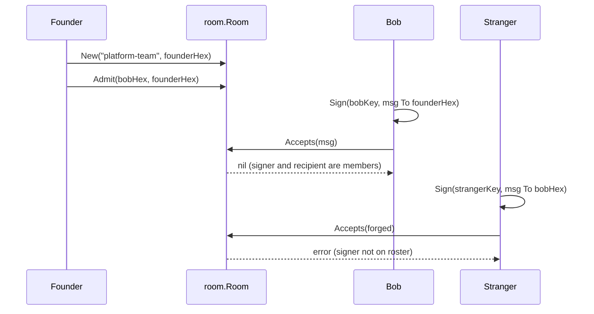

# Example: the room flow

This walkthrough shows admission in a standing group: the founder
creates a room, a moderator admits a member by its public key, the
member sends a signed message, and `Room.Accepts` gates it. A stranger
fails admission. `Sign` sets `Message.Signer` to the hex ed25519
public key, so the roster stores public keys, not person names. The
program builds and runs against the module.

## The admission sequence



## The program

```go
package main

import (
	"crypto/ed25519"
	"encoding/hex"
	"fmt"

	"github.com/MiviaLabs/mivia-ai-sdk/envelope"
	"github.com/MiviaLabs/mivia-ai-sdk/room"
)

func main() {
	_, founderKey, _ := ed25519.GenerateKey(nil)
	_, bobKey, _ := ed25519.GenerateKey(nil)
	_, strangerKey, _ := ed25519.GenerateKey(nil)

	founderHex := hex.EncodeToString(founderKey.Public().(ed25519.PublicKey))
	bobHex := hex.EncodeToString(bobKey.Public().(ed25519.PublicKey))

	// The founder creates the room; the founder's public key is the
	// first moderator.
	r, err := room.New("platform-team", founderHex)
	if err != nil {
		fmt.Println("new room:", err)
	}

	// The moderator admits a member by its public key.
	if err := r.Admit(bobHex, founderHex); err != nil {
		fmt.Println("admit:", err)
	}

	// The member signs a message; Sign stamps Signer to its key.
	msg, err := envelope.Sign(bobKey, envelope.Message{
		Version:    envelope.Version,
		ID:         "msg-1",
		Room:       "platform-team",
		ThreadID:   "task-42",
		Intent:     envelope.IntentRequest,
		Epistemic:  envelope.EpistemicInferred,
		Provenance: envelope.Provenance{Source: "model:self"},
		To:         []string{founderHex},
		Payload:    "Please review the plan.",
	})
	if err != nil {
		fmt.Println("sign:", err)
	}

	// The room admits the message: signer and recipient are members.
	if err := r.Accepts(msg); err != nil {
		fmt.Println("accepts:", err)
	}

	// A stranger cannot join the conversation.
	forged, err := envelope.Sign(strangerKey, envelope.Message{
		Version:    envelope.Version,
		ID:         "msg-2",
		Room:       "platform-team",
		ThreadID:   "task-42",
		Intent:     envelope.IntentQuery,
		Epistemic:  envelope.EpistemicAssumed,
		Provenance: envelope.Provenance{Source: "model:self"},
		To:         []string{bobHex},
		Payload:    "Who are you?",
	})
	if err != nil {
		fmt.Println("sign stranger:", err)
	}

	// The stranger's key is not on the roster, so admission fails.
	if err := r.Accepts(forged); err != nil {
		fmt.Println("stranger rejected:", err)
	}
}
```

## What the program shows

The member's message passes admission: the signer is the member's
public key, and the recipient is a member. The stranger's message
fails: the signer is not on the roster. `Accepts` also checks the
room name and the signature before membership.
