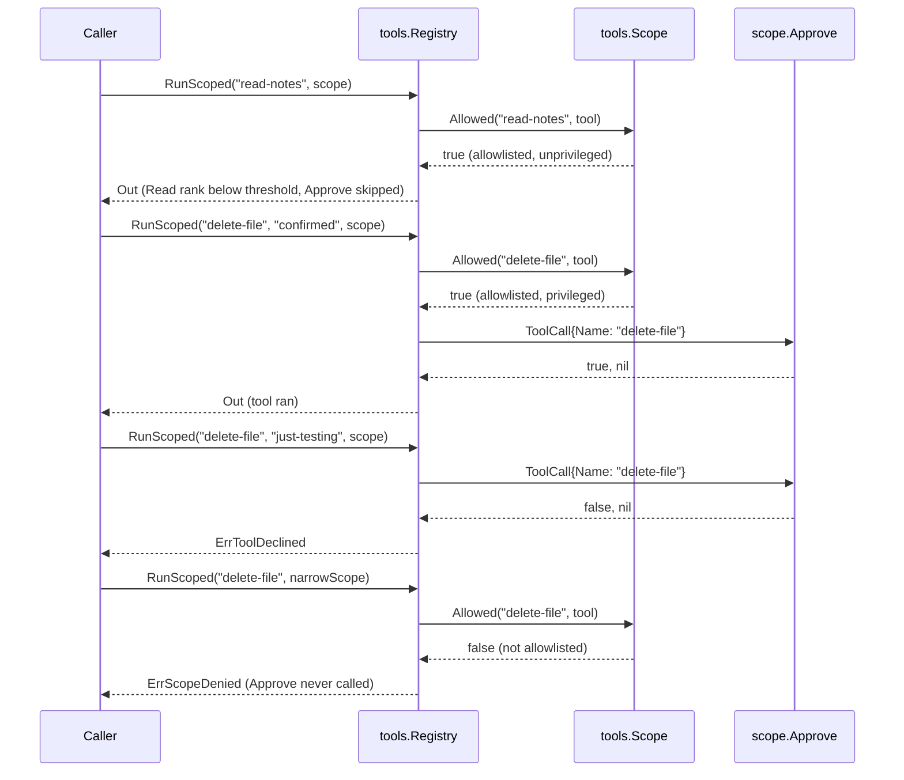

# Example: scoped tools and approval

This walkthrough shows a privileged tool gated behind two checks: a
`Scope`'s `Allowlist` and an `Approve` callback. A `delete-file` tool
implements `PrivilegedTool`, so `Scope.Allowed` denies it unless the
allowlist names it. Once allowlisted, its `ExecutionClassWrite`
profile meets the scope's `ApprovalThreshold`, so `RunScoped` calls
`Approve` before it runs the tool. A plain `read-notes` tool stays
below the threshold and skips approval entirely. The program builds
and runs against the module.

## The approval sequence



## The program

```go
package main

import (
	"context"
	"fmt"

	"github.com/MiviaLabs/mivia-ai-sdk/tools"
)

// readNotesTool reads notes. It is unprivileged and classed Read, so
// it never triggers approval when ApprovalThreshold is Write.
type readNotesTool struct{}

func (readNotesTool) Name() string { return "read-notes" }

func (readNotesTool) Run(_ context.Context, in tools.InOut) (tools.Out, error) {
	return tools.Out{Value: "notes: " + in.Value.(string)}, nil
}

func (readNotesTool) ExecutionProfile() tools.ExecutionProfile {
	return tools.ExecutionProfile{Class: tools.ExecutionClassRead}
}

// deleteFileTool deletes a file. It is privileged, so a Scope denies
// it unless the Allowlist names it. It is classed Write, so it meets
// an ApprovalThreshold of Write and triggers approval.
type deleteFileTool struct{}

func (deleteFileTool) Name() string { return "delete-file" }

func (deleteFileTool) Run(_ context.Context, in tools.InOut) (tools.Out, error) {
	return tools.Out{Value: "deleted: " + in.Value.(string)}, nil
}

func (deleteFileTool) ExecutionProfile() tools.ExecutionProfile {
	return tools.ExecutionProfile{Class: tools.ExecutionClassWrite}
}

func (deleteFileTool) Privileged() bool { return true }

func main() {
	reg := tools.New()
	_ = reg.Add(readNotesTool{})
	_ = reg.Add(deleteFileTool{})

	// approveCalled proves Approve runs only after Allowed passes.
	approveCalled := false
	approve := func(_ context.Context, call tools.ToolCall) (bool, error) {
		approveCalled = true
		reason, _ := call.In.Value.(string)
		fmt.Printf("approve requested: %s (%s)\n", call.Name, reason)
		return reason == "confirmed", nil
	}

	// scope allows both tools and gates a Write-class call through
	// approve. read-notes stays below the threshold and skips it.
	scope := tools.NewScope(tools.ScopeOptions{
		Allowlist:         []string{"read-notes", "delete-file"},
		Approve:           approve,
		ApprovalThreshold: tools.ExecutionClassWrite,
	})

	// read-notes is unprivileged and classed Read: Allowed passes and
	// approve never runs.
	approveCalled = false
	out, err := reg.RunScoped(context.Background(), "read-notes", tools.InOut{Value: "sprint-plan"}, scope)
	fmt.Println("read-notes result:", out.Value, "err:", err, "approve called:", approveCalled)

	// delete-file is privileged but allowlisted, so Allowed passes.
	// Its Write class meets the threshold, so approve runs and
	// approves this call.
	approveCalled = false
	out, err = reg.RunScoped(context.Background(), "delete-file", tools.InOut{Value: "confirmed"}, scope)
	fmt.Println("delete-file (confirmed) result:", out.Value, "err:", err, "approve called:", approveCalled)

	// The same tool, called with an unconfirmed reason, is declined.
	approveCalled = false
	out, err = reg.RunScoped(context.Background(), "delete-file", tools.InOut{Value: "just-testing"}, scope)
	fmt.Println("delete-file (unconfirmed) result:", out.Value, "err:", err, "approve called:", approveCalled)

	// A narrower scope omits delete-file from the Allowlist. Allowed
	// denies it before approve ever runs.
	narrowScope := tools.NewScope(tools.ScopeOptions{
		Allowlist:         []string{"read-notes"},
		Approve:           approve,
		ApprovalThreshold: tools.ExecutionClassWrite,
	})
	approveCalled = false
	out, err = reg.RunScoped(context.Background(), "delete-file", tools.InOut{Value: "confirmed"}, narrowScope)
	fmt.Println("delete-file (not allowlisted) result:", out.Value, "err:", err, "approve called:", approveCalled)
}
```

## What the program shows

`read-notes` runs with no approval prompt: it is unprivileged, so the
allowlist alone admits it, and its Read class ranks below the Write
threshold. `delete-file` is privileged, so the allowlist admits it
only by name; its Write class then meets the threshold, so `Approve`
runs before the tool does. The confirmed call approves and runs; the
unconfirmed call declines and returns `ErrToolDeclined`, and the tool
never runs. The narrow scope omits `delete-file` from its allowlist,
so `Allowed` denies the call before `Approve` ever runs.

The actual output:

```
read-notes result: notes: sprint-plan err: <nil> approve called: false
approve requested: delete-file (confirmed)
delete-file (confirmed) result: deleted: confirmed err: <nil> approve called: true
approve requested: delete-file (just-testing)
delete-file (unconfirmed) result: <nil> err: tools: tool declined by approval approve called: true
delete-file (not allowlisted) result: <nil> err: tools: tool denied by scope approve called: false
```
