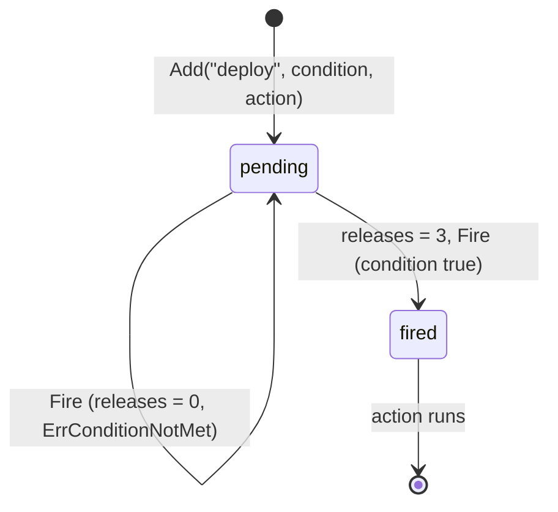

# Example: trigger condition and action

This walkthrough registers one named trigger on a `trigger.Registry`:
a `Condition` that checks a caller-side counter, and an `Action` that
prints a line. The first `Fire` call finds the condition false and
reports `ErrConditionNotMet`; the action never runs. The caller then
advances the counter, and a second `Fire` call finds the condition
true and runs the action. A `Fire` call against an unregistered name
reports `ErrUnknownName`. The program builds and runs against the
module.

## The fire sequence



## The program

```go
package main

import (
	"context"
	"errors"
	"fmt"

	"github.com/MiviaLabs/mivia-ai-sdk/trigger"
)

func main() {
	r := trigger.New()

	// releases counts how many builds have finished. The condition
	// only turns true once three builds finish.
	releases := 0

	condition := func(ctx context.Context) (bool, error) {
		return releases >= 3, nil
	}
	action := func(ctx context.Context) error {
		fmt.Println("deploying release")
		return nil
	}

	if err := r.Add("deploy", condition, action); err != nil {
		fmt.Println("add:", err)
		return
	}

	ctx := context.Background()

	// The condition is false: no builds have finished yet.
	err := r.Fire(ctx, "deploy")
	fmt.Println("first fire:", err)

	// Three builds finish; the condition now reports true.
	releases = 3

	err = r.Fire(ctx, "deploy")
	if err != nil {
		fmt.Println("second fire:", err)
		return
	}
	fmt.Println("second fire: ok")

	// Fire on an unregistered name reports ErrUnknownName.
	err = r.Fire(ctx, "rollback")
	fmt.Println("unknown fire:", errors.Is(err, trigger.ErrUnknownName))
}
```

## What the program shows

`Add` registers `"deploy"` with a `Condition` that reads the
`releases` counter and an `Action` that prints a line. The first
`Fire` call evaluates the condition while `releases` is `0`: the
condition reports false, so `Fire` returns `ErrConditionNotMet` and
never calls the action. Setting `releases` to `3` changes what the
condition reports on the next call; the registry holds no state of
its own. The second `Fire` call evaluates the condition again, finds
it true, and calls the action, which prints a line. A `Fire` call
against `"rollback"`, a name never passed to `Add`, returns
`ErrUnknownName`. The program prints `first fire: trigger: condition
not met`, `deploying release`, `second fire: ok`, and `unknown fire:
true`.
